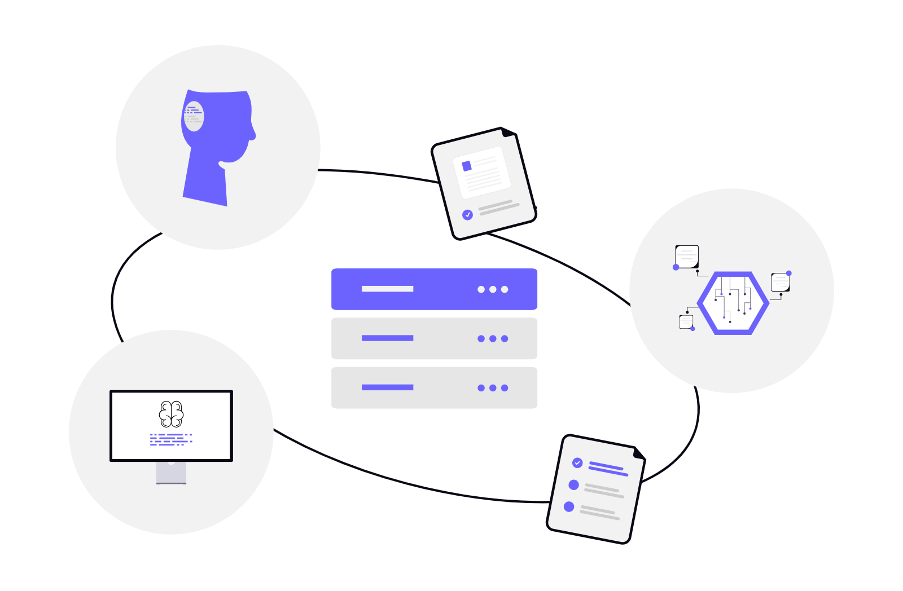

## Компьютер как система обработки данных

Теперь возникает естественный вопрос: а зачем вообще нужно именно такое разделение - почему нельзя обойтись одним «умным» блоком?

Дело в том, что любая вычислительная система в самом общем виде делает четыре вещи: получает данные, где-то их хранит, что-то с ними делает и передаёт результат дальше.

```text
                       получить данные
                              ↓
                        хранить данные
                              ↓
                       обработать данные
                              ↓
                      передать результат
```

Это не абстрактная теория - это буквально то, что происходит с нашим снимком из начала урока: *камера → данные → RAM → обработка → результат → экран или файл*. И если вместо камеры представить датчик температуры на промышленной линии, схема останется той же: *датчик → данные → вычислительная система → решение → исполнитель*.

Масштаб разный - фотография весит мегабайты, а показание датчика это одно число, - но принцип получения, хранения, обработки и передачи данных одинаков что для настольного ПК, что для сервера, что для крошечного микроконтроллера в роботе. Именно поэтому с первого урока полезно смотреть на компьютер не как на набор деталей, а как на систему, через которую движутся и обрабатываются данные.

---

## Программа и инструкции

Чтобы компьютер вообще что-то сделал, ему нужно описание того, какие действия выполнить. Такое описание называется **программой**: она содержит инструкции, которые определяют поведение системы. Но процессор не понимает человеческую фразу вроде «проверь температуру и включи вентилятор» - в конечном счёте программа превращается в набор простых **инструкций**, которые процессор умеет выполнять напрямую: сложить два числа, сравнить значения, загрузить данные из памяти, перейти к другой инструкции.

Пока достаточно запомнить одну вещь: программа задаёт, что нужно сделать, а процессор выполняет соответствующие ей инструкции одну за другой. То, как именно текст программы превращается в такие инструкции, - тема отдельного урока про компиляцию и интерпретацию.

Современные процессоры устроены куда сложнее простой последовательной машины: у них несколько ядер, кэш, конвейеры и другие механизмы ускорения. Но для первого понимания достаточно простой модели: **процессор выполняет инструкции, а инструкции работают с данными.**

---

## Где живут данные

На этом месте важно не запутаться: «данные» и «программа» - это не что-то абстрактное, у них есть вполне конкретное физическое место хранения. И таких мест в компьютере несколько, потому что у них разное назначение.

```text
                             CPU
                       ┌------┴------┐
                       |   Регистры  |  быстрее всего,
                       └------┬------┘  но очень мало места
                       ┌------┴------┐
                       |     Кэш     |  L1 / L2 / L3
                       └------┬------┘
                       ┌------┴------┐
                       |     RAM     |  рабочая память
                       └------┬------┘
                       ┌------┴------┐
                       |  SSD / HDD  |  долговременное
                       └-------------┘  хранение
```

Чем ближе память к процессору, тем она быстрее, но тем меньше её объём - большая и быстрая память одновременно почти никогда не получается, поэтому инженеры выстраивают несколько уровней. **RAM** - это оперативная рабочая память: в ней находится код запущенной программы, её переменные и текущее состояние. Она энергозависима - при выключении питания всё, что в ней было, исчезает. **Накопитель** (SSD, HDD, NVMe, eMMC) устроен для прямо противоположного: он медленнее, зато данные на нём сохраняются и после выключения компьютера. Короче говоря:

> RAM - это текущая работа. SSD - это долговременное хранение.

Именно поэтому программа обычно лежит на накопителе, а во время работы использует RAM: файл программы копируется в память, и уже там процессор с ним работает.



---

## Ввод-вывод: связь с внешним миром

Данные редко появляются из ниоткуда и редко на компьютере же и остаются. За связь с внешним миром отвечает **ввод-вывод (I/O)** - клавиатура, мышь, экран, камера, датчики, сеть, USB, моторы. Для обычного ПК это в первую очередь способ получить команду от человека и показать ему результат. Для робота это куда более прямая связь с реальностью: он получает данные от датчиков и передаёт команды моторам, замыкая цикл сам на себя:

*датчик → данные → вычисление → решение → команда → мотор → (и снова датчик)*

Вернёмся к нашей общей картине: именно ввод-вывод вместе с памятью и процессором и образует ту систему из первой схемы урока. Осталось посмотреть, как эти три части работают вместе на практике.

---

## Как всё это работает вместе: модель фон Неймана

Теперь, когда у нас есть все три части - процессор, память и ввод-вывод, - можно собрать их в одну простую и очень влиятельную схему. Она называется **моделью фон Неймана**, и её главная идея в том, что программа и данные лежат в общей памяти, а процессор по мере необходимости читает оттуда инструкции и данные, выполняет их и при необходимости обращается к устройствам ввода-вывода.

```text
                       ┌------------------┐
                       |      Память      |
                       |    инструкции +  |
                       |      данные      |
                       └--------┬---------┘
                         чтение / запись
                                ↓
                       ┌-----------------┐
                       |       CPU       |
                       |    выполнение   |
                       |    инструкций   |
                       └--------┬--------┘
                                ↓
                       ┌-----------------┐
                       |   Ввод-вывод    |
                       └-----------------┘
```

Это, конечно, сильно упрощённая картина. Современный компьютер дополнительно содержит несколько ядер, кэш, GPU или NPU для специализированных вычислений, контроллеры памяти и сети - обо всём этом у нас будут отдельные уроки. Но общий принцип, ради которого и стоит запомнить модель фон Неймана, остаётся неизменным: **программа задаёт действия → процессор выполняет инструкции → инструкции обрабатывают данные → результат используется дальше.**

---

## Операционная система и абстракции

Зачем нам вообще это знать, если программа и так работает? Дело в том, что на обычном ПК программа почти никогда не обращается к процессору, памяти или диску напрямую - между ней и аппаратурой стоит **операционная система**.

```text
                 ┌-----------------------------┐
                 |          Приложение         |
                 └--------------┬--------------┘
                                ↓
                 ┌-----------------------------┐
                 |       Библиотеки / API      |
                 └--------------┬--------------┘
                                ↓
                 ┌-----------------------------┐
                 |    Операционная система     |
                 |  процессы, память, файлы,   |
                 |        сеть, драйверы       |
                 └--------------┬--------------┘
                                ↓
                 ┌-----------------------------┐
                 |          Hardware           |
                 |    CPU, RAM, SSD, сеть...   |
                 └-----------------------------┘
```

ОС управляет памятью, процессами, файлами, устройствами и сетью - и благодаря этому программе не нужно знать физические детали конкретного диска или сетевой карты. Ей достаточно попросить: «сохрани этот файл» или «отправь эти данные по сети», а всё остальное - работу с драйвером, файловой системой, конкретным протоколом - операционная система возьмёт на себя.

Это и есть **абстракция**: сложная система прячет за собой детали и предоставляет более простой способ с собой работать. Мы будем встречать эту идею постоянно, потому что именно она позволяет строить настолько сложные системы, с которыми мы имеем дело сегодня. Подробнее про устройство самой операционной системы поговорим в отдельном разделе курса.

---

## Программа-файл и программа-процесс

Здесь стоит остановиться и провести важную границу. Программа как *файл* просто лежит на накопителе и ничего не делает - это набор инструкций и данных, ожидающих запуска. Но как только пользователь её запускает, операционная система создаёт для неё рабочее пространство в памяти, и возникает уже другая сущность - **работающая программа**, или **процесс**, со своим текущим состоянием: какие данные она уже прочитала, что сейчас вычисляет, что ещё не сохранила.

Файл программы и запущенная программа - не одно и то же, и путать их - частая ошибка новичков. Подробно про процессы, память под них и то, что именно делает ОС при запуске, мы разберём в отдельном уроке про операционные системы.

---

## Один и тот же принцип, разные устройства

Теперь можно вернуться к вопросу, с которого мы начали: почему одна и та же модель годится и для настольного ПК, и для крошечного микроконтроллера, и для робота. Обычный компьютер держит все части - CPU, RAM, накопитель, операционную систему - довольно явно разделёнными. Микроконтроллер устроен куда компактнее: у него часто нет полноценной ОС вообще, а есть небольшая память и прошивка, которая напрямую работает с датчиками и моторами через специальные выводы. Робот может вообще объединять несколько таких систем сразу: один контроллер отвечает за моторы, другой - за общую логику, а отдельный вычислительный блок - за обработку изображений с камеры.

Современный смартфон или ноутбук идёт ещё дальше: CPU, GPU, NPU и контроллеры памяти и сети часто объединены на одном кристалле - такую сборку называют SoC (System on Chip). Но какую бы из этих систем мы ни взяли, работает она по одной и той же схеме:

```text
                       получить данные
                              ↓
                       обработать данные
                              ↓
                      получить результат
                              ↓
                      передать результат
```

---

## Почему компьютер иногда «тормозит»

Вернёмся к нашей общей картине ещё раз, теперь с практической стороны. Фраза «компьютер тормозит» сама по себе мало что говорит, потому что задержка может возникнуть на любом из этапов, которые мы разбирали: пока данные едут по сети, пока диск отдаёт файл, пока процессор занят долгим вычислением, или просто пока программа ждёт ответа от какого-то устройства.

Например, если программа отправила запрос и ждёт ответа из сети, процессор в этот момент может почти ничего не делать - виновата не вычислительная мощность, а ожидание. А если, наоборот, идёт тяжёлое вычисление над уже полученными данными, именно CPU и будет узким местом. Поэтому у инженера, в отличие от обычного пользователя, первый вопрос при любом «тормозе» - не «почему компьютер плохой», а **на каком именно этапе возникает задержка**: при получении данных, при доступе к памяти или диску, при самом вычислении, или при передаче результата дальше.

---

## Инженерный взгляд на компьютер

Постепенно стоит привыкнуть смотреть на любую задачу через несколько простых вопросов: какие данные сейчас обрабатываются, где именно они находятся - в памяти, в кэше, на диске или на устройстве, - кто их обрабатывает: CPU, GPU или, может быть, микроконтроллер, и куда результат должен попасть дальше. Именно эти вопросы отличают «компьютер работает медленно» от куда более полезного «система долго ждёт данные с диска» - а такой конкретный вопрос уже можно решать.


---

## Практика

Возьмите любое знакомое действие - запуск программы, открытие изображения, загрузку веб-страницы или копирование файла - и попробуйте описать его как поток данных, например: *файл → память → обработка → результат → экран*. Затем представьте похожую систему для робота: *датчик → память → обработка → решение → мотор*.

Для каждого этапа задайте себе три вопроса: что сейчас передаётся, кто это обрабатывает и куда результат должен попасть дальше. Знать конкретные микросхемы или протоколы пока не нужно - цель упражнения в том, чтобы научиться видеть компьютер как систему хранения, передачи и обработки данных.

---

## Типичные ошибки новичков

Стоит сразу отметить три распространённых заблуждения. Первое - считать, что компьютер это и есть процессор; на самом деле CPU лишь один из нескольких равноправных компонентов системы. Второе - думать, что RAM и SSD различаются только объёмом; на деле у них разное назначение - RAM для текущей работы, SSD для долговременного хранения - и заменить одно другим нельзя. Третье - путать загруженность процессора на 100% с «зависанием»: высокая загрузка CPU может быть совершенно нормальной для тяжёлой вычислительной задачи, а вот реальные подвисания чаще всего вызваны ожиданием памяти, диска или сети, а вовсе не процессором.

---

## Что нужно запомнить

Компьютер - это вычислительная система, которая хранит данные, выполняет инструкции, обрабатывает информацию и взаимодействует с внешним миром. Программа задаёт, какие действия нужно выполнить, CPU эти инструкции выполняет, RAM обеспечивает текущую работу, накопитель хранит данные долговременно, а ввод-вывод связывает систему с внешним миром. Файл программы и работающая программа - разные сущности, а операционная система управляет ресурсами компьютера и прячет аппаратные детали за абстракциями. Этот же принцип работает и на обычном ПК, и на сервере, и на микроконтроллере, и в роботе - меняется только масштаб.

Главная модель урока, к которой мы будем возвращаться снова и снова:

```text
                       получить данные
                              ↓
                       хранить данные
                              ↓
                      обработать данные
                              ↓
                      передать результат
```

И главный вопрос, который стоит привыкнуть задавать: **где сейчас находятся данные, кто их обрабатывает и куда они должны попасть дальше?**

---

## Связь со следующим уроком

Теперь у нас есть общая модель компьютера. Следующий шаг - разобраться с его главным вычислительным компонентом: **процессором**. Мы посмотрим, что такое CPU, ядро, регистры, тактовая частота и инструкции, а также почему современный процессор нельзя оценивать только по количеству гигагерц.