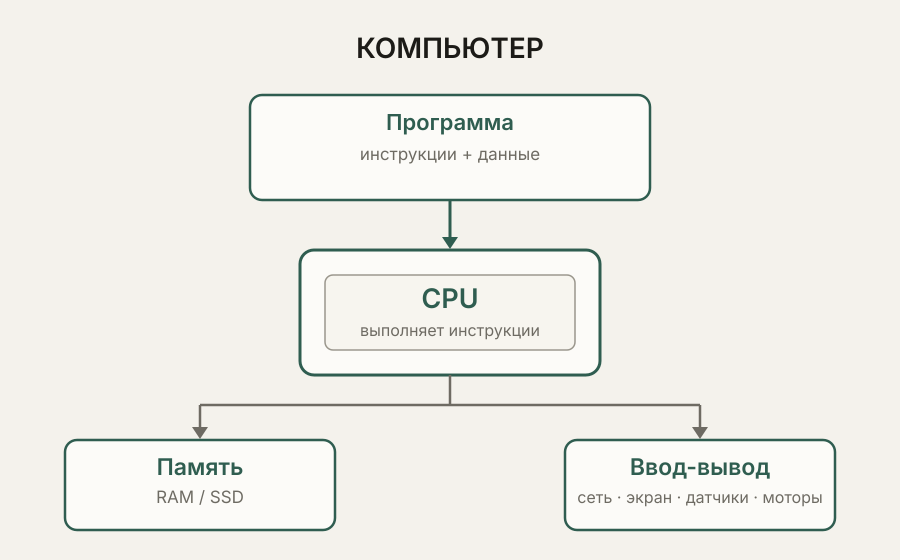

# Что такое компьютер

<p>Этот раздел — первая остановка в курсе. Здесь ещё нет языков программирования и командной строки: сначала нужно понять, из чего вообще состоит любой компьютер и что он делает. Камера сделала снимок. Снимок нужно где-то ненадолго положить, затем что-то с ним сделать — например, уменьшить размер, — а после этого показать на экране или сохранить в файл. Уже в этом простом действии видно, что компьютеру нужны как минимум три вещи: место для хранения данных, способность что-то с ними сделать и способ передать результат дальше.

Компьютер удобно рассматривать не как конкретное устройство вроде системного блока или ноутбука, а как **вычислительную систему, которая хранит данные, выполняет инструкции, обрабатывает информацию и взаимодействует с внешним миром**. Под это определение подходит обычный ПК, сервер, смартфон, микроконтроллер и даже робот. Внешне они совершенно разные, но общий принцип у них один:



Программа определяет, **что нужно сделать**, процессор выполняет инструкции, память хранит данные и текущее состояние системы, а ввод-вывод связывает компьютер с внешним миром. Поэтому компьютер — это не просто процессор и не набор отдельных микросхем, а **система взаимодействующих компонентов**.

## Компьютер как система обработки данных

Если отбросить конкретные детали, любая вычислительная система постоянно выполняет одну и ту же последовательность: **получает данные → хранит их → обрабатывает → передаёт результат дальше**. Это не абстрактная теория, а описание вполне реальной работы. Фотография проходит путь от камеры к памяти, затем обрабатывается и попадает на экран или в файл; датчик температуры передаёт число в контроллер, программа анализирует его и принимает решение, после чего команда уходит исполнительному механизму.

```text
                       получить данные
                              ↓
                        хранить данные
                              ↓
                       обработать данные
                              ↓
                      передать результат
```

Масштаб может быть совершенно разным: фотография весит мегабайты, показание датчика — всего несколько байт, а программа робота может постоянно обрабатывать поток изображений и показаний датчиков. Но принцип получения, хранения, обработки и передачи данных остаётся тем же. Поэтому полезно с самого начала смотреть на компьютер не как на «умный ящик», а как на **систему, через которую движутся и преобразуются данные**.

## Программа, инструкции и процессор

Чтобы компьютер вообще что-то сделал, ему нужно описание того, какие действия выполнить. Такое описание называется **программой**: она задаёт поведение системы. Но процессор не понимает человеческую фразу вроде «проверь температуру и включи вентилятор». В конечном счёте программа превращается в набор простых **инструкций**, которые процессор умеет выполнять: загрузить данные из памяти, сложить или сравнить значения, записать результат, перейти к другой инструкции и так далее.

Пока достаточно запомнить главное: **программа задаёт действия, а процессор выполняет соответствующие инструкции**. То, как текст программы превращается в такие инструкции, мы отдельно разберём при изучении компиляции и интерпретации.

Современный процессор намного сложнее простой последовательной машины: в нём есть несколько ядер, кэш, конвейеры и другие механизмы ускорения. Но для первого понимания достаточно простой модели: **процессор выполняет инструкции, а инструкции работают с данными**.

## Где находятся данные

Данные и программа — не абстрактные сущности. В каждый момент они физически находятся где-то в вычислительной системе, причём место может меняться в зависимости от того, что компьютер сейчас делает. У процессора есть очень маленькие и быстрые **регистры**, рядом находится быстрый **кэш**, затем более объёмная **RAM**, а для долговременного хранения используется **SSD или HDD**.


Чем ближе память к процессору, тем она быстрее, но тем меньше её объём. Поэтому вместо одной универсальной памяти инженеры используют несколько уровней. **RAM** — это оперативная рабочая память: в ней находятся код запущенных программ, их переменные и текущее состояние. Она энергозависима, поэтому при отключении питания её содержимое исчезает. **Накопитель** — SSD, HDD, NVMe, eMMC и другие подобные устройства — работает наоборот: он медленнее, зато сохраняет данные после выключения компьютера.

Можно запомнить очень простую границу:

> RAM — текущая работа. SSD — долговременное хранение.

Поэтому программа обычно лежит на накопителе, а после запуска её необходимые части оказываются в оперативной памяти, где с ними уже работает процессор.

```text
Файл программы на SSD
        ↓
Загрузка
        ↓
RAM
        ↓
CPU читает инструкции и данные
        ↓
Получается результат
```

Это же объясняет, почему файл программы и работающая программа — не одно и то же. Файл просто хранится на накопителе и сам по себе ничего не делает. Когда пользователь запускает его, операционная система создаёт рабочее пространство в памяти и запускает **процесс** — работающий экземпляр программы со своим текущим состоянием.

## Ввод-вывод и связь с внешним миром

Данные редко появляются из ниоткуда и редко остаются внутри компьютера навсегда. За обмен с внешним миром отвечает **ввод-вывод (I/O)**: клавиатура, мышь, экран, камера, датчики, сеть, USB-устройства, моторы и множество других устройств. Для обычного ПК это может быть ввод текста с клавиатуры и вывод изображения на монитор. Для робота это уже непосредственная связь с физическим миром: датчики передают измерения компьютеру, а компьютер отправляет команды исполнительным механизмам.

```text
датчик
   ↓
данные
   ↓
память
   ↓
обработка
   ↓
решение
   ↓
команда
   ↓
мотор
   ↓
изменение окружающего мира
   ↓
снова датчик
```

Так возникает замкнутый цикл: робот получает информацию о мире, обрабатывает её, принимает решение, воздействует на окружающую среду и снова получает новые данные. В обычном компьютере цикл может выглядеть менее очевидно, но принцип тот же: данные приходят через устройства ввода или сеть, обрабатываются программой, а результат отправляется пользователю, другому компьютеру или устройству.

## Модель фон Неймана

Теперь можно собрать процессор, память и ввод-вывод в одну общую картину. Одна из самых известных моделей вычислительной системы — **модель фон Неймана**. Её основная идея заключается в том, что программа и данные находятся в памяти, а процессор читает оттуда инструкции и данные, выполняет инструкции и при необходимости взаимодействует с устройствами ввода-вывода.

```text
                       ┌------------------┐
                       |      Память      |
                       |    инструкции +  |
                       |      данные      |
                       └--------┬---------┘
                         чтение / запись
                                ↓
                       ┌-----------------┐
                       |       CPU       |
                       |    выполнение   |
                       |    инструкций   |
                       └--------┬--------┘
                                ↓
                       ┌-----------------┐
                       |   Ввод-вывод    |
                       └-----------------┘
```

Это сильно упрощённая картина современного компьютера. В реальных системах есть несколько ядер, кэш, GPU или NPU, контроллеры памяти и сети, различные шины и множество других компонентов. Но общий принцип остаётся полезным: **программа задаёт действия → процессор выполняет инструкции → инструкции обрабатывают данные → результат используется дальше**.

## Операционная система и абстракции

На обычном компьютере программа почти никогда не обращается к аппаратуре напрямую. Между приложением и физическими устройствами находится **операционная система**, которая управляет процессами, памятью, файлами, устройствами и сетью.

```text
                 ┌-----------------------------┐
                 |          Приложение         |
                 └--------------┬--------------┘
                                ↓
                 ┌-----------------------------┐
                 |       Библиотеки / API      |
                 └--------------┬--------------┘
                                ↓
                 ┌-----------------------------┐
                 |    Операционная система     |
                 |  процессы, память, файлы,   |
                 |        сеть, драйверы       |
                 └--------------┬--------------┘
                                ↓
                 ┌-----------------------------┐
                 |          Hardware           |
                 |    CPU, RAM, SSD, сеть...   |
                 └-----------------------------┘
```

Представим, что программе нужно сохранить файл. Ей не требуется знать, как устроена конкретная микросхема SSD, как работает файловая система или какой контроллер отвечает за накопитель. Она обращается к операционной системе через определённый интерфейс, а ОС сама организует необходимые действия.

Это называется **абстракцией**: сложная система скрывает внутренние детали и предоставляет более простой способ работы с собой. Благодаря этому одна и та же программа может работать с разным оборудованием, не зная всех его физических особенностей. Идея абстракций будет встречаться практически во всех последующих разделах курса.

## Один принцип — разные компьютеры

Теперь становится понятно, почему одна и та же базовая модель подходит и для настольного ПК, и для сервера, и для микроконтроллера, и для робота. Обычный компьютер имеет мощный CPU, много RAM, накопитель и полноценную операционную систему. Микроконтроллер устроен гораздо компактнее: у него может не быть полноценной ОС, а небольшая программа напрямую работает с памятью, датчиками и исполнительными устройствами. Робот может объединять сразу несколько вычислительных систем: один контроллер управляет моторами, другой отвечает за общую логику, а отдельный компьютер обрабатывает изображения с камеры.

Современный смартфон или ноутбук может объединять CPU, GPU, NPU, контроллеры памяти и другие компоненты на одном кристалле — такую систему называют **SoC (System on Chip)**. Архитектура может сильно отличаться, но фундаментальный принцип остаётся прежним:

```text
получить данные
      ↓
обработать данные
      ↓
получить результат
      ↓
передать результат
```

Именно поэтому компьютер — это не обязательно устройство с монитором, клавиатурой и системным блоком. Компьютером может быть маленький контроллер внутри промышленного оборудования, вычислительный блок робота или микросхема внутри автомобиля.

## Почему компьютер иногда «тормозит»

Теперь ту же модель можно использовать уже как инженерный инструмент. Фраза «компьютер тормозит» сама по себе почти ничего не объясняет, потому что задержка может возникнуть на любом этапе: данные могут долго передаваться по сети, диск может медленно отдавать файл, процессор может быть занят вычислением, программа может ждать устройство или данные могут слишком долго находиться в памяти.

Например, если программа отправила запрос по сети и ждёт ответа, процессор в этот момент может почти ничего не делать. Проблема тогда не в недостатке вычислительной мощности, а в ожидании. Если же программа выполняет тяжёлое математическое вычисление, именно CPU может стать узким местом. Поэтому инженерный вопрос звучит не «почему компьютер плохой?», а **«на каком этапе возникает задержка?»**

Полезно привыкнуть смотреть на систему через несколько вопросов: какие данные сейчас обрабатываются, где они находятся — в регистрах, кэше, RAM, на диске или на внешнем устройстве, кто их обрабатывает — CPU, GPU, микроконтроллер или другой вычислительный блок — и куда должен попасть результат.

Так постепенно появляется настоящий инженерный взгляд на компьютер: вместо общего «тормозит» возникает конкретное описание вроде «программа долго ждёт данные с диска», «вычисление занимает слишком много времени» или «задержка появляется при обмене по сети».

## Практика

Знать микросхемы и протоколы пока не нужно. Цель этих заданий — научиться видеть компьютер как **путь данных**, а не как «серый ящик, который сам всё делает».

### Задание 1. Привычное действие

Выберите одно действие: открыть фотографию, скопировать файл или открыть страницу в браузере. Опишите цепочку своими словами: откуда появились данные, где они находятся во время работы, кто их обрабатывает и куда уходит результат. Если на каком-то этапе пока не знаете, что происходит, так и напишите — это нормальный результат первого знакомства с темой.

### Задание 2. Тот же принцип у робота

Опишите работу робота через тот же каркас: **датчик → данные → память → обработка → решение → мотор**. Объясните, чем этот путь похож на открытие фотографии и чем отличается.

### Задание 3. Где возникла задержка?

Представьте две ситуации: в первой программа выполняет тяжёлое вычисление и полностью загружает процессор, во второй процессор почти свободен, но программа ждёт ответ из сети. Объясните, почему пользователь в обоих случаях может сказать «компьютер тормозит», хотя причины совершенно разные.

### Задание 4. Файл и запущенная программа

Объясните своими словами разницу между файлом программы на накопителе и уже запущенным процессом. Что находится на диске, что появляется в RAM и что происходит с содержимым оперативной памяти после отключения питания?

### Задание 5. Компьютер без экрана

Представьте контроллер промышленной установки, у которого нет монитора и клавиатуры. Можно ли считать его компьютером? Объясните ответ через понятия данных, инструкций, обработки и ввода-вывода.

### Задание 6. Найдите узкое место

Придумайте собственный пример системы, которая «тормозит». Затем предложите три возможные причины: одну связанную с вычислениями, одну с хранением или памятью и одну с передачей данных. Для каждой причины объясните, какой этап общего пути данных стал узким местом.

## Типичные ошибки новичков

Первая распространённая ошибка — считать, что компьютер и процессор это одно и то же. CPU действительно выполняет инструкции, но без памяти, устройств ввода-вывода и других компонентов полноценная вычислительная система работать не сможет. Вторая ошибка — считать RAM и SSD одинаковой памятью, различающейся только объёмом. Их назначение принципиально разное: RAM хранит текущее состояние работающих программ, а SSD предназначен для долговременного хранения. Третья ошибка — считать, что загрузка CPU на 100% обязательно означает зависание: высокая загрузка может быть совершенно нормальной для тяжёлого вычисления, а задержка может возникать и тогда, когда процессор почти свободен, например при ожидании диска или сети. Наконец, не стоит думать, что компьютер буквально «понимает» фотографию, текст или команду человека так же, как человек. На физическом уровне он выполняет инструкции над данными и следует заданной программе.

## Что нужно запомнить

Компьютер — это вычислительная система, которая **хранит данные, выполняет инструкции, обрабатывает информацию и взаимодействует с внешним миром**. Программа задаёт действия, процессор выполняет инструкции, память хранит данные и состояние работы, накопитель обеспечивает долговременное хранение, а ввод-вывод связывает систему с окружающим миром. Операционная система управляет ресурсами компьютера и скрывает многие аппаратные детали за абстракциями. Файл программы и работающий процесс — разные сущности. Тот же общий принцип можно увидеть в ПК, сервере, смартфоне, микроконтроллере и роботе — меняется масштаб и конкретная реализация, но не фундаментальная идея.

И главный вопрос, который стоит привыкнуть задавать при изучении любой вычислительной системы:

> **Где сейчас находятся данные, кто их обрабатывает и куда они должны попасть дальше?**

## Связь со следующим уроком

Теперь у нас есть общая модель компьютера. Следующий шаг — разобраться с его главным вычислительным компонентом: **процессором**. Мы посмотрим, что такое CPU, ядро, регистры, тактовая частота и инструкции, а также почему современный процессор нельзя оценивать только по количеству гигагерц.