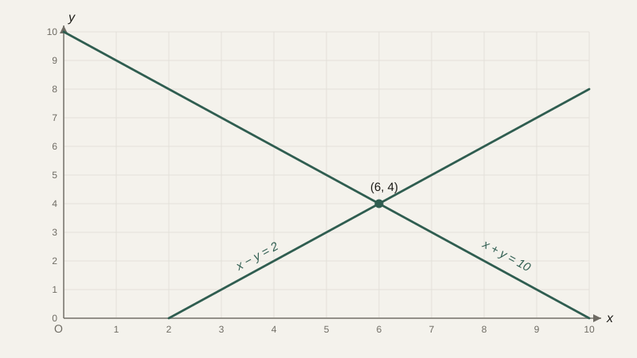

# Уравнения и системы уравнений

В прошлом уроке переменная использовалась, чтобы что-то вычислить: подставил значение — получил результат. Но есть и обратная по духу задача: результат уже известен, а найти нужно значение переменной, при котором этот результат получается. Это и есть **уравнение** — равенство, которое верно не при любом значении переменной, а только при определённом (или определённых).

## Что значит «решить уравнение»

Уравнение $2x + 3 = 11$ утверждает: существует такое $x$, при котором левая часть равна правой. Решить уравнение — значит найти это значение (или доказать, что его нет, или что их несколько). Для линейного уравнения решение находится переносом слагаемых и делением:

$$
2x + 3 = 11 \;\;\Rightarrow\;\; 2x = 11 - 3 \;\;\Rightarrow\;\; 2x = 8 \;\;\Rightarrow\;\; x = 4
$$

Главное правило, которое стоит за каждым таким шагом: уравнение остаётся верным, если выполнить одну и ту же операцию над обеими его частями одновременно — вычесть одно и то же число, умножить обе части на одно и то же ненулевое число. Именно поэтому можно «перенести 3 в другую сторону, поменяв знак» — на самом деле это сокращённая запись того, что мы вычли 3 из обеих частей равенства.

```python
# Проверка через подстановку найденного решения
x = 4
print(2 * x + 3 == 11)  # True
```

## Геометрический смысл: где линия пересекает ось

Линейное уравнение $2x + 3 = 11$ можно прочитать и геометрически: если построить график функции $y = 2x + 3$, решение уравнения — это та точка $x$, где график достигает высоты $y = 11$. Более привычная форма — $2x + 3 - 11 = 0$, то есть $2x - 8 = 0$: тогда решение — это точка, где график функции $y = 2x - 8$ пересекает горизонтальную ось. Эта геометрическая картинка пригодится уже в следующем блоке курса, когда мы перейдём к графикам функций.

## Системы уравнений: несколько условий одновременно

Часто в задаче есть не одна неизвестная, а несколько, и несколько условий, которым они должны удовлетворять одновременно. Например:

$$
\begin{cases} x + y = 10 \\ x - y = 2 \end{cases}
$$

Здесь нужно найти такую пару $(x, y)$, которая удовлетворяет **обоим** уравнениям сразу. Один из способов решения — сложить уравнения почленно, чтобы избавиться от одной из переменных:

$$
(x+y) + (x-y) = 10 + 2 \;\;\Rightarrow\;\; 2x = 12 \;\;\Rightarrow\;\; x = 6
$$

Подставив $x = 6$ в первое уравнение, находим $y = 4$. Проверка: $6+4=10$ и $6-4=2$ — оба условия выполняются.

Геометрически каждое линейное уравнение с двумя переменными — это прямая на плоскости, а решение системы — это точка, в которой эти прямые пересекаются:



Если прямые параллельны, решения нет — условия противоречат друг другу. Если прямые совпадают, решений бесконечно много — второе условие ничего не добавляет к первому.

## Решение системы программой

Вручную подбирать комбинацию сложения и вычитания для систем с большим числом переменных неудобно, и на практике такие системы решают вычислительно. Уже сейчас полезно увидеть, что одна и та же задача решается и вручную, и кодом:

```python
import numpy as np

# x + y = 10
# x - y = 2
A = np.array([[1, 1], [1, -1]])
b = np.array([10, 2])

solution = np.linalg.solve(A, b)
print(solution)  # [6. 4.]
```

Здесь мы пока не объясняем, что такое матрица `A` формально — это тема отдельного блока курса. Важно увидеть сам принцип: система уравнений компактно записывается как матрица коэффициентов и вектор правых частей, и именно в таком виде её умеют решать численные библиотеки.

## Типичные ошибки

Частая ошибка при решении вручную — выполнить операцию только над одной частью уравнения, забыв про вторую, из-за чего равенство перестаёт быть верным. Вторая — перепутать знак при переносе слагаемого через знак равенства: перенос всегда меняет знак слагаемого на противоположный, и пропуск этого шага — источник почти всех арифметических ошибок в линейных уравнениях. Третья, уже на уровне систем — забыть проверить найденное решение подстановкой в оба исходных уравнения, а не только в одно из них: ошибка на промежуточном шаге может случайно дать число, которое удовлетворяет первому уравнению, но не второму.

## Что нужно запомнить

Уравнение — это равенство, верное лишь при определённых значениях переменной, и решить его — значит найти эти значения, применяя к обеим частям одинаковые операции. Система уравнений требует одновременного выполнения нескольких условий, и геометрически для линейных уравнений с двумя переменными это выглядит как пересечение прямых. На практике системы с большим числом переменных решают не вручную, а через матричную запись и вычислительные библиотеки — но смысл остаётся тем же самым.

## Задачи

1. Решите уравнение 3x − 7 = 11.
2. Решите уравнение 5(x − 2) = 2x + 4.
3. Решите систему: x + y = 12, x − y = 2.
4. Решите систему: 2x + y = 7, x − y = 2.
5. Постройте график функции y = 2x − 8 мысленно или на бумаге и укажите, где он пересекает ось x. Сравните с решением уравнения 2x − 8 = 0.
6. Объясните геометрически, что значит, что система уравнений не имеет решений.
7. При каком условии система двух линейных уравнений с двумя переменными имеет бесконечно много решений?
8. Составьте систему уравнений по условию: сумма двух чисел равна 20, а их разность равна 4. Решите её.

## Где это понадобится дальше

Матричная форма записи системы уравнений станет куда понятнее в блоке про матрицы и линейную алгебру, а сама идея «найти значение, которое удовлетворяет условию» в изменённом виде вернётся при разговоре о градиентном спуске — там тоже ищут точку, удовлетворяющую определённому условию, только условие там — минимум функции, а не равенство нулю.
