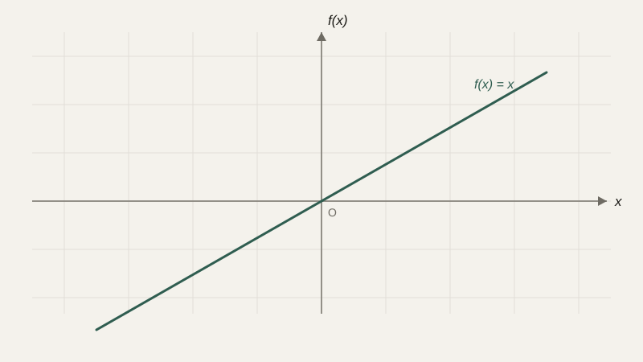

# Функции и графики

Мы уже несколько раз в этом курсе писали что-то вроде `speed(v0, a, t)` или `distance(x1, y1, x2, y2)` — и каждый раз это была функция: правило, которое по входным значениям вычисляет результат. Настало время разобраться с этой идеей по-настоящему, потому что функция — одно из центральных понятий всей математики и почти всего программирования одновременно.

## Функция как правило преобразования

**Функция** — это правило, которое каждому значению из одного множества (его называют **областью определения**) ставит в соответствие ровно одно значение из другого множества (**область значений**). Это слово «ровно одно» принципиально: если одному входному значению могло бы соответствовать несколько разных результатов, правило не было бы функцией — это было бы что-то менее определённое.

Функцию принято записывать как $y = f(x)$: $x$ — **аргумент**, то есть вход, $f$ — имя самого правила, $y$ — **значение функции**, то есть результат. Например, функция $f(x) = x^2$ — это правило «возведи в квадрат»: $f(3) = 9$, $f(-2) = 4$.

```text
   x (аргумент)
        ↓
      f(x)
        ↓
   y (значение)
```

## Область определения и область значений

**Область определения** — это все допустимые значения аргумента, при которых функция вообще имеет смысл. Для $f(x) = \frac{1}{x}$ область определения — все числа, кроме нуля, потому что делить на ноль нельзя. Для $f(x) = \sqrt{x}$ — только неотрицательные числа, потому что квадратный корень из отрицательного числа не является действительным числом.

**Область значений** — это все значения, которые функция реально может принять. Для $f(x) = x^2$ область значений — все неотрицательные числа: какое бы число мы ни возвели в квадрат, результат никогда не будет отрицательным.

Понимание области определения — не абстрактная формальность: именно отсюда берутся многие реальные ошибки в коде. Если функция деления или извлечения корня получает значение вне своей области определения, программа либо упадёт с исключением, либо (что хуже) молча вернёт бессмысленный результат вроде `NaN` («не число»).

```python
import math

def safe_sqrt(x):
    if x < 0:
        raise ValueError("Квадратный корень определён только для x >= 0")
    return math.sqrt(x)
```

## Функция в математике и функция в программировании

Здесь важно провести ту же границу, что мы проводили для переменных. Математическая функция $f(x) = x^2$ — это чистое правило: при одном и том же $x$ она всегда и везде возвращает одно и то же значение, и не имеет никакого «побочного эффекта» — не меняет ничего вокруг себя. Функция в программировании технически может вести себя иначе: она может читать и изменять внешние переменные, печатать что-то на экран, менять состояние базы данных.

```python
counter = 0

def increment():
    global counter
    counter += 1
    return counter

print(increment())  # 1
print(increment())  # 2 — тот же вызов с теми же (отсутствующими) аргументами даёт другой результат!
```

Функция `increment` — это не математическая функция в строгом смысле слова, потому что она не задаёт однозначного соответствия между входом (которого здесь вообще нет) и результатом: вызов с одними и теми же условиями в разные моменты времени даёт разные ответы. Функции, которые ведут себя как настоящие математические функции — всегда возвращают один и тот же результат при одних и тех же аргументах и не трогают ничего вокруг, — называют **чистыми функциями**, и в программировании их намеренно стараются писать как можно чаще: их проще тестировать, переиспользовать и понимать.

## Линейная и квадратичная функции

Две самые частые в практике функции стоит знать по виду формулы сразу. **Линейная функция** $f(x) = kx + b$ задаёт прямую линию: $k$ определяет наклон (насколько быстро растёт или падает значение), $b$ — сдвиг по вертикали (значение при $x=0$). **Квадратичная функция** $f(x) = ax^2 + bx + c$ задаёт параболу — кривую с одной вершиной, где функция достигает минимума (если $a>0$) или максимума (если $a<0$).

```python
def linear(x, k=2, b=1):
    return k * x + b

def quadratic(x, a=1, b=0, c=0):
    return a * x**2 + b * x + c
```

## График функции

Формулу функции можно не только вычислять, но и **видеть**. Если отложить значения аргумента $x$ по горизонтальной оси, а соответствующие значения $f(x)$ — по вертикальной, получится **график функции** — множество точек $(x, f(x))$. Подробно координатную плоскость мы разберём уже в следующем уроке, а здесь важно увидеть саму идею: график — это визуальный «портрет» функции, который сразу показывает то, что по одной формуле разглядеть сложнее — где функция растёт, где убывает, где достигает наибольшего или наименьшего значения на интересующем нас промежутке.



```python
import matplotlib.pyplot as plt

xs = [x / 10 for x in range(-30, 31)]
ys = [x**2 for x in xs]

plt.plot(xs, ys)
plt.show()  # парабола y = x²
```

Код выше не добавляет новой математики — он просто вычисляет функцию во множестве точек и соединяет их линией, то есть механически строит то же самое, что мы описали словами абзацем выше.

## Обратная функция и композиция функций

**Обратная функция** $f^{-1}$ «отменяет» действие исходной: если $f$ переводит $x$ в $y$, то $f^{-1}$ переводит $y$ обратно в $x$. Мы уже видели пример такой пары: возведение в квадрат и квадратный корень, степень и логарифм — это взаимно обратные операции (с оговорками об области определения, которые обсуждались в прошлом уроке).

**Композиция функций** — это применение одной функции к результату другой: $(f \circ g)(x) = f(g(x))$ — сначала выполняется $g$, затем к результату применяется $f$. В программировании композиция — это просто вызов одной функции внутри результата другой:

```python
def double(x):
    return x * 2

def add_one(x):
    return x + 1

result = double(add_one(3))  # сначала add_one(3) = 4, затем double(4) = 8
print(result)  # 8
```

Эта идея — строить сложное поведение, комбинируя простые функции одну за другой, — лежит в основе и функционального программирования, и устройства нейронных сетей, где каждый слой — это, по сути, ещё одна функция, применённая к результату предыдущей.

## Типичные ошибки

Частая ошибка начинающих — не проверять область определения перед использованием функции, особенно деления и корня, что приводит к падению программы на «граничных» входных данных, которые не встретились при тестировании. Вторая — путать функцию с её значением в конкретной точке: $f$ — это правило целиком, а $f(3)$ — одно конкретное число, результат применения правила. Третья — злоупотреблять побочными эффектами там, где можно обойтись чистой функцией: это не ошибка в математическом смысле, но источник трудноуловимых багов, когда функция неожиданно меняет что-то за пределами своего результата.

## Что нужно запомнить

Функция — это однозначное правило, которое каждому значению аргумента из области определения ставит в соответствие одно значение из области значений. Математическая функция всегда возвращает одно и то же для одного и того же входа, тогда как функция в программировании может иметь побочные эффекты — стремиться к «чистым» функциям обычно хорошая практика. Линейная и квадратичная функции — два базовых вида, которые стоит узнавать сразу по формуле, а композиция функций — способ строить сложное поведение из простых составных частей.

## Задачи

1. Для функции f(x) = 2x - 3 найдите f(0), f(2), f(-1).
2. Найдите область определения функции f(x) = 1/(x-5).
3. Найдите область определения функции f(x) = √(x-2).
4. Для f(x) = x² найдите область значений.
5. Постройте на бумаге (или опишите словами) график функции f(x) = x + 2 и укажите, где он пересекает ось y.
6. Для f(x) = x² и g(x) = x + 1 найдите композицию f(g(x)) и g(f(x)). Совпадают ли они?
7. Является ли функция f(x) = x² обратимой на всей числовой прямой? Обоснуйте через определение обратной функции.
8. Приведите пример функции из программирования, которая не является «чистой» (не ведёт себя как математическая функция), и объясните почему.

## Где это понадобится дальше

Следующий логичный шаг — увидеть функции не только как формулы, но и как графики: это даёт геометрическую интуицию, которая очень пригодится позже, когда мы будем говорить о производной как о наклоне графика функции.
