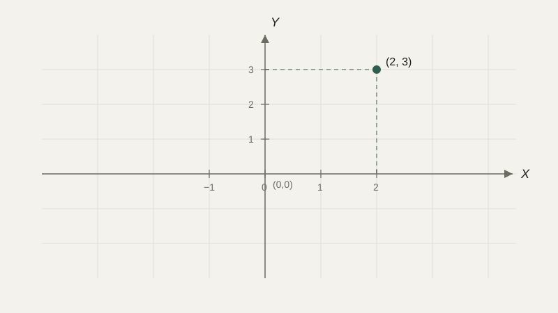
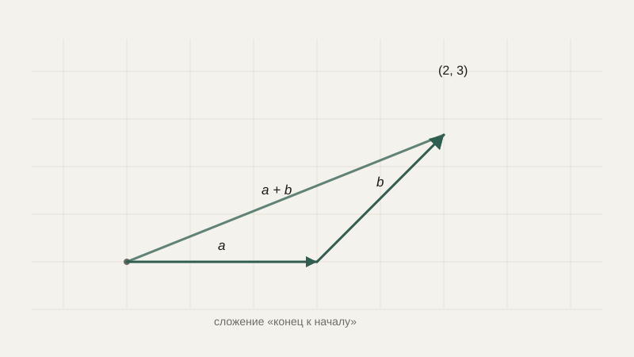

# Координатная плоскость и векторы

До сих пор мы работали с отдельными числами и функциями одной переменной. Но очень многие задачи — положение робота в комнате, движение объекта на экране, цвет пикселя, набор признаков объекта для нейросети — по своей природе не сводятся к одному числу. Нужен способ описывать **положение и направление** в пространстве, и для этого математика предлагает координаты и векторы.

## Координатная плоскость

**Координатная плоскость** задаётся двумя перпендикулярными числовыми прямыми — осью $X$ (горизонтальной) и осью $Y$ (вертикальной), которые пересекаются в точке **начала координат** $(0, 0)$. Любая точка плоскости однозначно описывается парой чисел $(x, y)$ — её координатами: насколько сдвинуться вправо (или влево, если $x$ отрицательно) и насколько вверх (или вниз).



Стоит сразу отметить важную практическую деталь: в математике ось $Y$ традиционно направлена вверх, а в большинстве систем компьютерной графики и в пиксельных координатах экрана — вниз (точка $(0,0)$ находится в левом верхнем углу, а $y$ растёт по направлению вниз). Это не ошибка и не исключение — а просто другое соглашение, которое нужно каждый раз сознательно проверять, когда переходите от математической модели к конкретному графическому API.

## Вектор как направленный отрезок

**Вектор** — это величина, у которой есть не только числовое значение (**длина**, или модуль), но и **направление**. Вектор удобно представлять как стрелку от одной точки к другой, но на практике чаще всего работают не с самой стрелкой, а с её координатами — насколько она сдвигает точку по $x$ и по $y$: $\vec{v} = (v_x, v_y)$.

Отличие вектора от точки принципиально, хотя записываются они одинаково — парой чисел. Точка $(2, 3)$ — это конкретное место на плоскости. Вектор $(2, 3)$ — это смещение: «сдвинуться на 2 вправо и на 3 вверх», и это смещение можно применить к любой точке, а не только к началу координат.

```python
# Точка и вектор смещения — разные вещи, хотя выглядят одинаково
point = (5, 1)
offset = (2, 3)

new_point = (point[0] + offset[0], point[1] + offset[1])
print(new_point)  # (7, 4)
```

## Операции над векторами

**Сложение векторов** выполняется покомпонентно: $\vec{a} + \vec{b} = (a_x + b_x,\; a_y + b_y)$. Геометрически это соответствует тому, что мы только что сделали в коде выше — последовательному применению двух смещений одно за другим.

**Умножение вектора на число** (скаляр) меняет его длину, сохраняя направление (или разворачивает его на противоположное, если число отрицательное): $k\vec{v} = (k v_x, k v_y)$. Если вектор скорости равен $(3, 0)$ (движение вправо со скоростью 3 единицы в секунду), то $2\vec{v} = (6, 0)$ — то же направление, вдвое быстрее, а $-1\vec{v} = (-3, 0)$ — та же скорость, но в противоположную сторону.



## Длина вектора

Длина (модуль) вектора вычисляется по теореме Пифагора — это, по сути, та же формула расстояния, с которой мы уже встречались в первом уроке курса, просто применённая к смещению, а не к двум точкам:

$$
|\vec{v}| = \sqrt{v_x^2 + v_y^2}
$$

```python
import math

def vector_length(vx, vy):
    return math.sqrt(vx**2 + vy**2)

print(vector_length(3, 4))  # 5.0
```

Если вектор нужен только для указания направления, а не величины, его часто **нормализуют** — делят на собственную длину, получая вектор той же направленности, но с длиной ровно 1 (единичный вектор):

$$
\hat{v} = \frac{\vec{v}}{|\vec{v}|}
$$

## Где это используется на практике

Положение робота на плоскости — это точка с координатами $(x, y)$, а его скорость — вектор, показывающий, в каком направлении и как быстро эта точка смещается на каждом шаге времени. Движение объекта в игре на каждом кадре — это прибавление вектора скорости к вектору позиции. В компьютерном зрении признаки изображения часто представляют вектором из многих чисел (не только двух) — и тогда «похожесть» двух изображений буквально измеряется расстоянием между этими векторами в многомерном пространстве, точно той же формулой, что мы вывели для двух точек на плоскости.

```python
def step(position, velocity, dt=1.0):
    return (position[0] + velocity[0] * dt, position[1] + velocity[1] * dt)

pos = (0, 0)
vel = (2, 1)
for _ in range(3):
    pos = step(pos, vel)
print(pos)  # (6.0, 3.0)
```

## Типичные ошибки

Частая путаница — складывать координаты точки с координатами вектора, не отдавая себе отчёт, что это операции с разным смыслом: сложение двух точек (а не точки и вектора смещения) обычно вообще не имеет геометрического смысла. Вторая ошибка — забывать о разнице направления оси $Y$ между математикой и конкретным графическим API, из-за чего объект на экране движется «не в ту сторону». Третья — пытаться нормализовать нулевой вектор (длина которого равна нулю), что приводит к делению на ноль — в реальном коде это стоит явно проверять заранее.

## Что нужно запомнить

Координаты задают положение точки на плоскости, а вектор — направление и величину смещения, и хотя оба записываются парой чисел, это разные по смыслу объекты. Векторы складываются покомпонентно, умножение на число меняет их длину (и, возможно, разворачивает направление), а длина вектора вычисляется через теорему Пифагора. Эта модель напрямую описывает движение объектов, положение роботов и признаки объектов в компьютерном зрении.

## Задачи

1. Постройте (словесно или на бумаге) точки A(2, 3) и B(5, 7) на координатной плоскости.
2. Найдите вектор смещения из точки A(2, 3) в точку B(5, 7).
3. Даны векторы a = (3, 4) и b = (1, -2). Найдите a + b и a - b.
4. Найдите длину вектора (6, 8).
5. Вектор v = (2, -1). Найдите 3v и -2v.
6. Объясните на примере, почему «точка (2,3) плюс точка (5,7)» в общем случае не имеет геометрического смысла, а «точка плюс вектор» — имеет.
7. Робот находится в точке (0, 0) и должен переместиться в точку (10, 10) за 5 одинаковых шагов. Найдите вектор одного шага.
8. Найдите единичный вектор (длины 1), сонаправленный с вектором (3, 4).

## Где это понадобится дальше

В следующем уроке мы продолжим работу с векторами и доберёмся до скалярного произведения — операции, которая измеряет не только расстояние, но и угол между направлениями, что окажется неожиданно важным для машинного обучения.
