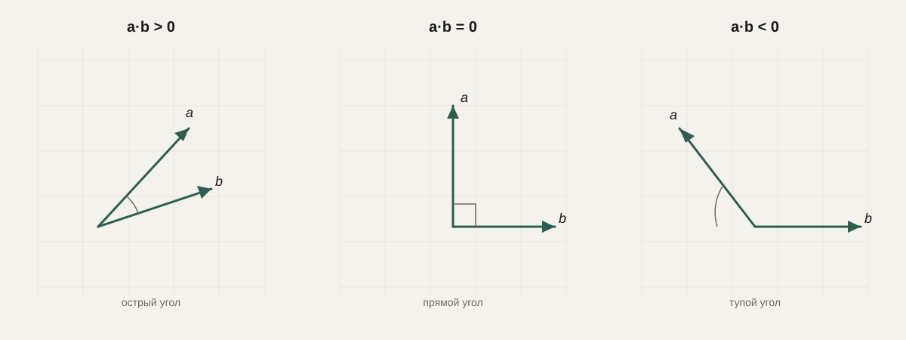
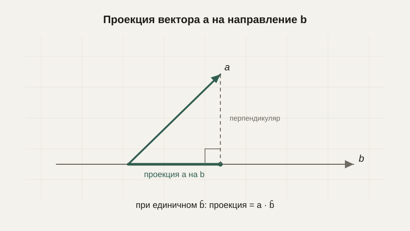

# Скалярное произведение, угол и проекция

Мы уже умеем находить длину вектора и расстояние между точками. Следующий естественный вопрос: а как сравнить **направления** двух векторов — насколько они похожи, смотрят ли они примерно в одну сторону или в противоположные? Ответ на этот вопрос даёт одна из самых часто используемых операций во всей линейной алгебре — скалярное произведение.

## Расстояние между точками — напоминание и обобщение

Мы уже выводили формулу расстояния между двумя точками на плоскости через теорему Пифагора:

$$
d = \sqrt{(x_2-x_1)^2 + (y_2-y_1)^2}
$$

Эта же идея без всяких изменений обобщается на пространство с любым числом измерений — нужно просто добавить ещё слагаемые под корнем для каждой следующей координаты. Для трёхмерного пространства:

$$
d = \sqrt{(x_2-x_1)^2 + (y_2-y_1)^2 + (z_2-z_1)^2}
$$

И это же обобщение работает для векторов, у которых не три, а сто или тысяча компонентов — именно так в машинном обучении измеряют «расстояние» между объектами, описанными множеством признаков.

## Скалярное произведение: формула и смысл

**Скалярное произведение** (или dot product) двух векторов — это число, которое получается умножением соответствующих компонентов и последующим сложением результатов:

$$
\vec{a} \cdot \vec{b} = a_x b_x + a_y b_y
$$

Название «скалярное» подчёркивает, что результат — это обычное число (скаляр), а не вектор, в отличие от самих $\vec{a}$ и $\vec{b}$.

```python
def dot(a, b):
    return sum(ai * bi for ai, bi in zip(a, b))

print(dot((2, 3), (4, -1)))  # 2*4 + 3*(-1) = 5
```

Формула простая, но её геометрический смысл не очевиден сразу — а именно он и делает скалярное произведение таким полезным.

## Геометрический смысл: угол между векторами

Оказывается, скалярное произведение связано с углом $\theta$ между векторами следующим соотношением:

$$
\vec{a} \cdot \vec{b} = |\vec{a}|\,|\vec{b}|\cos\theta
$$

Отсюда можно выразить сам угол:

$$
\cos\theta = \frac{\vec{a} \cdot \vec{b}}{|\vec{a}|\,|\vec{b}|}
$$

Это даёт практичный способ понять знак скалярного произведения без вычисления угла явно. Если векторы направлены примерно в одну сторону, $\cos\theta$ близок к 1, и скалярное произведение — положительное большое число. Если векторы перпендикулярны ($\theta = 90°$), $\cos\theta = 0$, и скалярное произведение равно нулю — это, кстати, самый быстрый способ проверить перпендикулярность векторов, не вычисляя угол вовсе. Если векторы направлены в противоположные стороны, скалярное произведение отрицательно.



```python
import math

def angle_between(a, b):
    cos_theta = dot(a, b) / (vector_length(*a) * vector_length(*b))
    return math.degrees(math.acos(cos_theta))

def vector_length(x, y):
    return math.sqrt(x**2 + y**2)

print(angle_between((1, 0), (0, 1)))  # 90.0 — перпендикулярны
```

## Проекция вектора

Скалярное произведение также лежит в основе **проекции** одного вектора на направление другого — буквально «тени», которую один вектор отбрасывает на линию, заданную другим.



Если вектор $\hat{b}$ единичный (длины 1), длина проекции вектора $\vec{a}$ на его направление равна просто $\vec{a} \cdot \hat{b}$. Если же $\vec{b}$ не единичный, его сначала нормализуют (мы уже делали это в уроке про векторы), а затем применяют ту же формулу:

$$
\text{длина проекции } \vec{a} \text{ на } \vec{b} = \frac{\vec{a} \cdot \vec{b}}{|\vec{b}|}
$$

Сам же вектор проекции (а не только его длина) получается умножением этой длины на единичный вектор направления $\hat b$:

$$
\text{проекция}_{\vec b}(\vec a) = \left(\frac{\vec{a} \cdot \vec{b}}{|\vec{b}|^2}\right) \vec{b}
$$

```python
import numpy as np

a = np.array([3, 4])
b = np.array([1, 0])

projection_length = np.dot(a, b) / np.linalg.norm(b)
projection_vector = (np.dot(a, b) / np.dot(b, b)) * b
print(projection_length)  # 3.0
print(projection_vector)  # [3. 0.]
```

Эта идея используется, например, чтобы разложить силу тяжести на составляющую вдоль наклонной плоскости и перпендикулярную ей в задачах физики и робототехники: любой вектор можно разбить на сумму двух составляющих — вдоль заданного направления (это и есть проекция) и перпендикулярно ему (разность исходного вектора и проекции), и дальше анализировать каждую составляющую по отдельности, что часто сильно упрощает задачу.

## Почему скалярное произведение так важно в машинном обучении

В машинном обучении и компьютерном зрении объекты — изображения, слова, пользователи — часто представляют векторами из многих чисел, которые называют **эмбеддингами**: похожие по смыслу объекты оказываются рядом в этом многомерном пространстве, то есть векторы, описывающие их, направлены похожим образом. Скалярное произведение (или тесно связанная с ним **косинусная близость**, то есть просто $\cos\theta$ из формулы выше) — это и есть стандартный способ измерить, насколько «похожи» два таких вектора, не завязываясь на их абсолютную длину, а только на направление.

Кроме того, скалярное произведение — это в буквальном смысле основная операция внутри каждого искусственного нейрона: взвешенная сумма входов нейрона $w_1 x_1 + w_2 x_2 + \ldots + w_n x_n$ — это ровно скалярное произведение вектора входов $\vec{x}$ и вектора весов $\vec{w}$.

## Типичные ошибки

Частая ошибка — забывать, что скалярное произведение возвращает число, а не вектор, и пытаться использовать результат там, где ожидается направление. Вторая — вычислять угол через формулу выше, не проверив, что ни один из векторов не является нулевым (иначе в знаменателе окажется ноль). Третья — путать скалярное произведение с покомпонентным умножением векторов (когда просто умножают $a_x \cdot b_x$ и $a_y \cdot b_y$ отдельно, оставляя вектор из двух чисел, а не складывая их в одно число) — это другая операция с другим смыслом и другим названием (поэлементное произведение).

## Что нужно запомнить

Формула расстояния между точками без изменений обобщается на пространство любой размерности. Скалярное произведение двух векторов — это число, которое показывает, насколько похоже направлены векторы: положительное для острого угла, ноль для перпендикулярных векторов, отрицательное для тупого угла. Эта на первый взгляд простая операция лежит в основе измерения схожести объектов в машинном обучении и в основе того, как работает отдельный искусственный нейрон.

## Задачи

1. Вычислите скалярное произведение векторов (3, 4) и (2, -1).
2. Найдите длину вектора (5, 12) и длину вектора (8, 15).
3. Вычислите расстояние между точками (1, 1) и (4, 5).
4. Найдите угол между векторами (1, 0) и (1, 1) (в градусах).
5. Проверьте, перпендикулярны ли векторы (2, 3) и (3, -2), вычислив их скалярное произведение.
6. Найдите длину проекции вектора (4, 3) на направление вектора (1, 0).
7. Объясните, почему скалярное произведение двух сонаправленных векторов максимально при фиксированных длинах векторов.
8. Два вектора-эмбеддинга имеют косинусную близость, равную -0.9. Что это говорит об их смысловой схожести?

## Где это понадобится дальше

Логичное продолжение работы с углами — тригонометрия, которой посвящён следующий урок: мы увидим, откуда вообще берётся $\cos\theta$ в формуле выше, и как с его помощью описывать вращение и периодическое движение.
