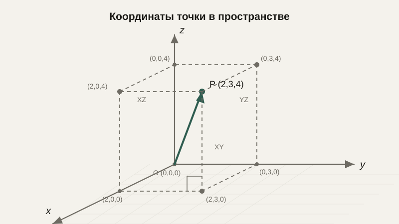

# Геометрия в пространстве: координаты и векторы в 3D

До сих пор все наши точки и векторы жили на плоскости — двух координат было достаточно. Но робот перемещается не по листу бумаги, а по комнате, дрон летает не в двух, а в трёх измерениях, а камера видит мир, в котором у объектов есть не только ширина и высота, но и глубина. Хорошая новость в том, что почти всё, что мы уже знаем про координаты и векторы, без принципиальных изменений обобщается на пространство — нужно просто добавить третью координату.

## Координаты в пространстве

Если на плоскости точка задавалась парой $(x, y)$, в пространстве точка задаётся тройкой $(x, y, z)$ — третья ось, $z$, перпендикулярна первым двум и обычно обозначает «глубину» или «высоту», в зависимости от принятого соглашения в конкретной задаче. Как и в 2D, конкретное направление осей — это вопрос договорённости, а не универсального закона природы: в робототехнике ось $z$ часто направлена вверх, а в компьютерной графике — иногда «от экрана к зрителю» или наоборот, и эту договорённость, как и направление оси $y$ в 2D-графике из более раннего урока, всегда стоит явно проверять в конкретной используемой системе или библиотеке.



## Векторы в 3D

Вектор в пространстве — это, как и прежде, тройка чисел $(v_x, v_y, v_z)$, и все операции, которые мы изучали для плоскости, переносятся без всяких сюрпризов, просто с одним дополнительным слагаемым в каждой формуле. Сложение:

$$
\vec{a} + \vec{b} = (a_x+b_x,\; a_y+b_y,\; a_z+b_z)
$$

Длина вектора — та же теорема Пифагора, применённая уже к трём координатам, а не к двум:

$$
|\vec{v}| = \sqrt{v_x^2 + v_y^2 + v_z^2}
$$

Скалярное произведение — тоже прямое обобщение формулы из более раннего урока:

$$
\vec{a} \cdot \vec{b} = a_x b_x + a_y b_y + a_z b_z
$$

и сохраняет тот же геометрический смысл: связь с углом между векторами через $\vec{a}\cdot\vec{b} = |\vec{a}||\vec{b}|\cos\theta$, включая всё, что мы знаем о перпендикулярности (скалярное произведение равно нулю) и сонаправленности.

```python
import numpy as np

a = np.array([1, 2, 3])
b = np.array([4, 0, -1])

print(a + b)              # [5 2 2]
print(np.linalg.norm(a))  # длина: примерно 3.74
print(np.dot(a, b))       # скалярное произведение: 1
```

## Векторное произведение: операция, которой не было на плоскости

В трёхмерном пространстве появляется операция, у которой на плоскости просто не было аналога, — **векторное произведение** $\vec{a} \times \vec{b}$. В отличие от скалярного произведения, результат векторного произведения — это не число, а новый **вектор**, перпендикулярный сразу обоим исходным векторам $\vec{a}$ и $\vec{b}$:

$$
\vec{a} \times \vec{b} = (a_y b_z - a_z b_y,\;\; a_z b_x - a_x b_z,\;\; a_x b_y - a_y b_x)
$$

Направление результата определяется правилом правой руки: если пальцы правой руки направлены от $\vec a$ к $\vec b$ по кратчайшему повороту, большой палец укажет направление $\vec a \times \vec b$. Длина же результата равна площади параллелограмма, который образуют $\vec a$ и $\vec b$, если отложить их от одной точки.

```python
a = np.array([1, 0, 0])
b = np.array([0, 1, 0])
print(np.cross(a, b))  # [0 0 1] — перпендикулярно обоим, как и ожидалось
```

Практический пример: если $\vec a$ и $\vec b$ — две стороны плоской поверхности (например, грани объекта в 3D-модели), их векторное произведение даёт **вектор нормали** — направление, перпендикулярное этой поверхности, что активно используется в компьютерной графике для расчёта освещения (насколько поверхность обращена к источнику света) и в робототехнике для определения ориентации плоскости, по которой движется манипулятор.

## Плоскость в пространстве

На плоскости (2D) прямую линию можно задать уравнением $ax+by=c$. В пространстве прямым аналогом уравнения является не прямая, а **плоскость** — двумерная поверхность внутри трёхмерного пространства, которая задаётся похожим уравнением с тремя переменными:

$$
ax + by + cz = d
$$

Вектор $(a, b, c)$ в этом уравнении — это и есть нормаль к плоскости, вектор, перпендикулярный ей, — то самое понятие, с которым мы только что познакомились через векторное произведение. Понимание плоскости как объекта, задаваемого точкой и вектором нормали, напрямую используется в компьютерном зрении (например, чтобы описать плоскость пола или стола, которую должен «видеть» робот) и в 3D-графике.

## Типичные ошибки

Частая ошибка — путать скалярное и векторное произведение: первое даёт число, второе — вектор, и это принципиально разные по типу результата операции с разным геометрическим смыслом. Вторая — забывать, что векторное произведение, в отличие от скалярного, не коммутативно даже по знаку: $\vec a \times \vec b = -(\vec b \times \vec a)$, порядок сомножителей меняет направление результата на противоположное. Третья — путать направление осей координат между разными библиотеками или системами (например, направление оси $z$ «от экрана» или «в экран»), что приводит к зеркально перевёрнутым результатам при визуализации.

## Что нужно запомнить

Точки и векторы в пространстве — это тройки чисел, и большинство операций (сложение, длина, скалярное произведение) переносятся из 2D в 3D простым добавлением третьего слагаемого в формулу. Векторное произведение — новая операция, характерная именно для трёхмерного (и отчасти семимерного, что выходит за рамки этого курса) пространства: она возвращает вектор, перпендикулярный обоим исходным, с длиной, равной площади образованного ими параллелограмма. Плоскость в пространстве задаётся точкой и вектором нормали — прямым применением идеи векторного произведения.

## Задачи

1. Даны точки A(1, 2, 3) и B(4, 6, 8). Найдите вектор смещения из A в B и его длину.
2. Даны векторы a = (1, 2, 2) и b = (2, 0, -1). Найдите a + b и a - b.
3. Вычислите скалярное произведение векторов a = (1, 0, 1) и b = (0, 1, 1).
4. Перпендикулярны ли векторы из задачи 3? Обоснуйте через результат скалярного произведения.
5. Вычислите векторное произведение a = (1, 0, 0) и b = (0, 0, 1). Проверьте, что результат перпендикулярен обоим исходным векторам (через скалярное произведение).
6. Найдите длину вектора (2, 3, 6).
7. Объясните своими словами, зачем в компьютерной графике нужен вектор нормали к поверхности.
8. Запишите уравнение плоскости, перпендикулярной вектору (1, 1, 1) и проходящей через точку (0, 0, 0).

## Где это понадобится дальше

Трёхмерные координаты и векторное произведение подготовили нас к следующему шагу — тригонометрии, где мы вернёмся к вращению и углам, уже держа в уме, что реальные объекты, которые нужно вращать, живут не только на плоскости, но и в пространстве.
