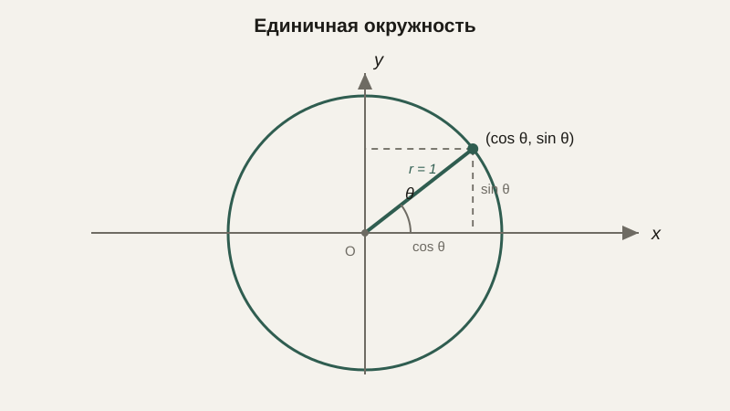
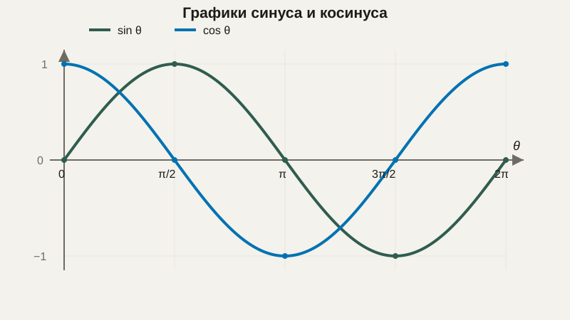

# Тригонометрия: радианы, единичная окружность, вращение

Несколько уроков назад мы уже использовали $\cos\theta$ в формуле скалярного произведения, не объяснив толком, откуда он берётся, а затем расширили координаты и векторы до трёх измерений. Пора вернуться к углам вплотную и разобраться с тригонометрией — разделом математики, который описывает связь между углами и отношениями сторон, а на практике — почти любое вращение, колебание или периодическое движение, с которым сталкивается программист.

## Градусы и радианы

Угол можно измерять в привычных **градусах** (полный оборот — 360°) или в **радианах** — единице, которая связывает угол напрямую с длиной дуги окружности единичного радиуса: один радиан — это угол, при котором длина дуги равна радиусу окружности. Полный оборот в радианах равен $2\pi$, поэтому перевод между единицами делается через пропорцию:

$$
\text{радианы} = \text{градусы} \cdot \frac{\pi}{180}
$$

Важно сразу привыкнуть: **почти все функции в программировании и во всей высшей математике используют радианы, а не градусы**. Это не произвольное соглашение, а следствие того, что многие формулы анализа (в частности, производные тригонометрических функций, о которых пойдёт речь позже в курсе) имеют простой вид только при измерении угла в радианах. Забытый перевод градусов в радианы — одна из самых частых ошибок новичков в графике и робототехнике.

```python
import math

print(math.radians(180))  # 3.141592653589793 — это π
print(math.degrees(math.pi / 2))  # 90.0
```

## Единичная окружность и определение синуса и косинуса

Возьмём окружность радиуса 1 с центром в начале координат — **единичную окружность**. Если отложить от положительного направления оси $X$ угол $\theta$ против часовой стрелки, точка, в которую мы попадём на окружности, имеет координаты $(\cos\theta, \sin\theta)$ — это и есть определение синуса и косинуса: координаты точки на единичной окружности, соответствующей данному углу.



Отсюда сразу следует одно из самых используемых тождеств тригонометрии — просто теорема Пифагора, применённая к точке на единичной окружности (расстояние от центра до точки на окружности равно радиусу, то есть 1):

$$
\sin^2\theta + \cos^2\theta = 1
$$

**Тангенс** определяется как отношение синуса к косинусу, $\tan\theta = \frac{\sin\theta}{\cos\theta}$, и геометрически равен наклону прямой, идущей из начала координат под углом $\theta$.

## Графики синуса и косинуса

Если откладывать угол $\theta$ по горизонтальной оси, а значение $\sin\theta$ — по вертикальной, получится волнообразная, периодически повторяющаяся кривая — именно поэтому синус и косинус называют «периодическими функциями»:



Косинус выглядит точно так же, но сдвинут по горизонтали на четверть периода. Эта «волна» — не абстрактная кривая, а математическое описание всего, что колеблется или повторяется: звуковой сигнал, переменный электрический ток, годовой цикл температуры, колебание маятника.

## Вращение точки и движение по окружности

Если точка должна двигаться по окружности радиуса $r$ вокруг центра $(cx, cy)$, её положение в момент, когда пройденный угол равен $\theta$, вычисляется напрямую через синус и косинус:

$$
x = cx + r\cos\theta \qquad y = cy + r\sin\theta
$$

```python
import math

def point_on_circle(cx, cy, r, theta):
    x = cx + r * math.cos(theta)
    y = cy + r * math.sin(theta)
    return x, y

# Точка на окружности радиуса 5 вокруг (0, 0) после поворота на 90°
print(point_on_circle(0, 0, 5, math.radians(90)))  # (3.06e-16, 5.0) — то есть (0, 5)
```

Небольшое число вместо ровного нуля в примере выше — не ошибка, а как раз одна из тех особенностей чисел с плавающей точкой, о которых подробно пойдёт речь дальше в курсе: $\cos(90°)$ математически равен нулю, но компьютер хранит приближённое значение $\pi$, из-за чего результат получается очень близким к нулю, но не идеально точным.

Эта же формула лежит в основе анимации вращения в графике, расчёта траектории движения робота по дуге и описания колебательных сигналов в обработке звука.

## Поворот вектора на угол

Чуть более общая и очень практичная задача — повернуть произвольный вектор $(x, y)$ на угол $\theta$, не обязательно двигаясь по окружности вокруг начала координат. Формула поворота:

$$
x' = x\cos\theta - y\sin\theta \qquad y' = x\sin\theta + y\cos\theta
$$

```python
def rotate(x, y, theta):
    x_new = x * math.cos(theta) - y * math.sin(theta)
    y_new = x * math.sin(theta) + y * math.cos(theta)
    return x_new, y_new
```

Эта формула — частный случай матричного преобразования, с которым мы подробно встретимся в блоке про матрицы: поворот — это один из видов линейного преобразования пространства.

## Типичные ошибки

Самая частая ошибка — передать в функцию `sin`/`cos` значение в градусах, забыв перевести его в радианы: результат при этом не выдаст ошибку, а просто окажется математически бессмысленным, что особенно трудно отловить при отладке. Вторая — путать порядок аргументов в формуле поворота или перепутать знак у `sin` в одной из строк, что развернёт вращение в обратную сторону. Третья — ожидать от тригонометрических вычислений на компьютере абсолютно точного нуля или единицы там, где математически должен получиться ровно ноль, — как мы видели выше, на практике получается очень близкое, но не идеальное значение.

## Что нужно запомнить

Радианы — это стандартная единица измерения угла в программировании и высшей математике, и перевод из градусов в радианы нужно выполнять явно. Синус и косинус — это координаты точки на единичной окружности, соответствующей данному углу, а их график — периодическая волна, которая описывает любое колебательное или вращательное движение. Формулы движения по окружности и поворота вектора напрямую строятся на синусе и косинусе и используются в графике, робототехнике и обработке сигналов.

## Задачи

1. Переведите 150° в радианы.
2. Переведите 5π/6 радиан в градусы.
3. Используя единичную окружность, найдите sin(90°) и cos(180°) без калькулятора.
4. Докажите, что sin²(θ) + cos²(θ) = 1, используя теорему Пифагора и определение синуса/косинуса через единичную окружность.
5. Найдите координаты точки на окружности радиуса 10 с центром в начале координат после поворота на угол 60°.
6. Поверните вектор (1, 0) на угол 180° по формуле поворота и проверьте результат.
7. Объясните, почему функции sin и cos периодичны, и укажите длину их периода.
8. Чему равен tan(45°)? Выразите его через sin и cos.

## Где это понадобится дальше

Тригонометрия — последний самостоятельный блок перед переходом к матрицам и линейной алгебре, где поворот, с которым мы только что познакомились через формулу, станет частным случаем куда более общего языка матричных преобразований.
