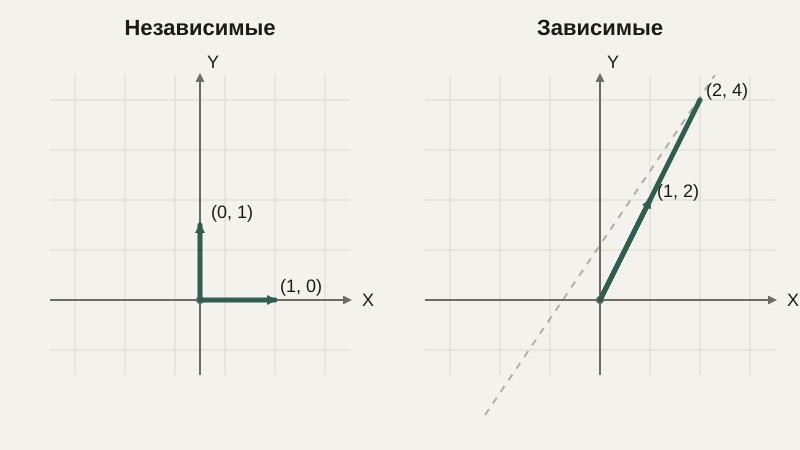

# Векторные пространства: линейные комбинации, независимость, базис

Мы много работали с конкретными векторами и матрицами, но не задавались вопросом, который завершает блок линейной алгебры и напрямую понадобится при разговоре о данных и машинном обучении: сколько вообще нужно «базовых направлений», чтобы описать любую точку в пространстве, и что значит, что одно направление «не добавляет ничего нового» относительно уже имеющихся?

## Линейная комбинация

**Линейная комбинация** нескольких векторов — это их сумма, взятая с некоторыми числовыми коэффициентами:

$$
c_1 \vec{v}_1 + c_2 \vec{v}_2 + \ldots + c_n \vec{v}_n
$$

Например, вектор $(7, 4)$ можно получить как линейную комбинацию базовых направлений $(1, 0)$ и $(0, 1)$ с коэффициентами 7 и 4: $7\cdot(1,0) + 4\cdot(0,1) = (7,4)$. Это, по сути, именно то, что мы и так всегда делали, когда записывали вектор парой чисел — координаты вектора это и есть коэффициенты его линейной комбинации из базовых направлений осей.

```python
import numpy as np

v1 = np.array([1, 0])
v2 = np.array([0, 1])
result = 7 * v1 + 4 * v2
print(result)  # [7 4]
```

## Линейная независимость

Два вектора называют **линейно независимыми**, если ни один из них нельзя получить как масштабированную копию другого (а для большего числа векторов — если ни один из них нельзя выразить как линейную комбинацию остальных). Векторы $(1, 0)$ и $(0, 1)$ независимы — они указывают в принципиально разных направлениях, и никаким растяжением одного нельзя получить другой. А вот векторы $(1, 2)$ и $(2, 4)$ **зависимы**: второй — это просто первый, умноженный на 2, он не добавляет никакого нового направления, лишь повторяет уже имеющееся с другим масштабом.



Это ровно та же идея, с которой мы встречались в уроке про определитель: если один из векторов, образующих матрицу, линейно зависим от другого, определитель этой матрицы равен нулю — геометрически векторы «схлопываются» в одну линию вместо того, чтобы охватывать всю плоскость.

## Базис и размерность

Минимальный набор линейно независимых векторов, линейными комбинациями которого можно получить **любую** точку пространства, называют **базисом**. На обычной плоскости для этого достаточно ровно двух независимых векторов — например, привычных $(1,0)$ и $(0,1)$, но подойдёт и любая другая пара независимых направлений. Число векторов в базисе — это и есть **размерность** пространства: для плоскости она равна 2, для привычного трёхмерного пространства — 3.

Важно, что базис не обязан состоять именно из «горизонтали» и «вертикали» — это лишь самый удобный, стандартный выбор. Любые два независимых вектора образуют полноценный базис, просто координаты одной и той же точки будут выглядеть по-разному в зависимости от того, какой базис выбран — то есть относительно каких направлений мы её описываем.

## Пространства с большим числом измерений

Вся эта логика без изменений обобщается на пространства с любым числом измерений — просто представить их «на глаз» уже не получится, хотя формулы остаются ровно теми же самыми. Если объект описывается 50 числовыми признаками (рост, вес, возраст и ещё 47 других характеристик), он является точкой в 50-мерном пространстве, и вопрос «сколько независимых направлений реально нужно, чтобы описать эти данные» — это не праздное любопытство, а одна из центральных задач анализа данных: часто оказывается, что из 50 признаков лишь немногие по-настоящему независимы, а остальные — почти линейные комбинации первых (например, «общая площадь квартиры» почти полностью определяется «числом комнат» и «площадью одной комнаты», это не два независимых источника информации, а почти один).

Методы вроде PCA (метод главных компонент), которые часто встречаются в анализе данных и машинном обучении, — это, по сути, способ автоматически найти наиболее информативный, компактный базис для конкретного набора данных, отбросив направления, которые почти не добавляют независимой информации. Мы не будем разбирать PCA подробно в этом курсе, но важно увидеть: сама идея возможна только благодаря понятиям базиса и линейной независимости, которые мы только что разобрали.

## Типичные ошибки

Частая ошибка — считать, что «независимость» векторов как-то связана с их длиной или с тем, перпендикулярны ли они друг другу: это не так, перпендикулярность — частный, особенно удобный случай независимости, но независимыми могут быть и векторы под произвольным не прямым углом друг к другу, лишь бы они не лежали на одной прямой (в двумерном случае) или в одной плоскости (при увеличении размерности). Вторая ошибка — путать размерность пространства с количеством чисел, описывающих объект, когда среди этих чисел есть линейно зависимые — реальная, «эффективная» размерность данных может оказаться меньше, чем число столбцов в таблице данных. Третья — забывать, что выбор базиса влияет только на то, как записываются координаты точки, но не на саму точку: это та же идея, что мы уже видели в уроке про системы счисления — смена записи не меняет сам объект.

## Что нужно запомнить

Линейная комбинация — это сумма векторов с числовыми коэффициентами, а линейная независимость означает, что ни один вектор из набора нельзя получить комбинацией остальных. Базис — минимальный набор независимых векторов, достаточный, чтобы линейными комбинациями описать любую точку пространства, а число векторов в базисе и есть размерность этого пространства. Эта идея напрямую обобщается на пространства с множеством измерений и лежит в основе того, как в анализе данных ищут действительно независимые, информативные признаки.

## Задачи

1. Выразите вектор (5, 3) как линейную комбинацию векторов (1, 0) и (0, 1).
2. Являются ли векторы (2, 4) и (1, 2) линейно независимыми? Обоснуйте.
3. Являются ли векторы (1, 0) и (0, 1) и (1, 1) линейно независимыми на плоскости? Сколько из них максимум может быть независимыми на плоскости?
4. Образуют ли векторы (1, 1) и (1, -1) базис плоскости? Обоснуйте.
5. Выразите вектор (4, 0) как линейную комбинацию базисных векторов (1, 1) и (1, -1) из предыдущей задачи.
6. Чему равна размерность пространства, базисом которого служат векторы (1,0,0), (0,1,0), (0,0,1)?
7. Объясните своими словами, почему добавление четвёртого вектора к уже найденному базису трёхмерного пространства не может дать дополнительно независимое направление.

## Где это понадобится дальше

Базис и размерность напрямую понадобятся в следующем уроке, где мы разберём ранг матрицы — число, которое, по сути, измеряет, сколько независимых направлений реально задаёт матрица, используя ровно те же понятия, что мы ввели здесь.
