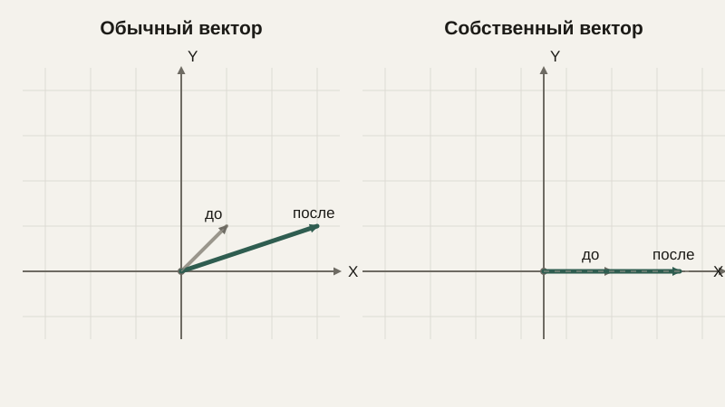

# Собственные значения и собственные векторы

Мы уже знаем, что умножение на матрицу обычно и поворачивает, и растягивает вектор одновременно — в общем случае направление вектора после преобразования меняется. Но у почти каждой матрицы есть особые, исключительные направления, которые преобразование не поворачивает вовсе — только растягивает или сжимает. Такие направления называют собственными векторами, и этот урок завершает блок линейной алгебры, собирая воедино всё, что мы изучили про матрицы как преобразования.

## Определение

**Собственный вектор** матрицы $A$ — это ненулевой вектор $\vec{v}$, который после умножения на $A$ остаётся направленным туда же (или строго в противоположную сторону), просто меняя длину в $\lambda$ раз:

$$
A\vec{v} = \lambda \vec{v}
$$

Число $\lambda$ называют **собственным значением**, соответствующим этому собственному вектору. Если $\lambda > 1$, вектор вдоль этого направления растягивается; если $0 < \lambda < 1$ — сжимается; если $\lambda < 0$ — разворачивается в противоположную сторону (и тоже меняет длину, если $|\lambda| \neq 1$).

```python
import numpy as np

A = np.array([[2, 0], [0, 3]])
eigenvalues, eigenvectors = np.linalg.eig(A)
print(eigenvalues)   # [2. 3.]
print(eigenvectors)  # столбцы — собственные векторы
```

Для этой конкретной диагональной матрицы собственные векторы — это как раз базовые направления осей $x$ и $y$: вектор $(1,0)$ растягивается ровно в 2 раза (это и есть первое собственное значение), а вектор $(0,1)$ — ровно в 3 раза. Это не случайность: для диагональной матрицы собственные значения всегда стоят прямо на диагонали, а собственные векторы совпадают с базовыми осями — это самый простой и наглядный случай, на котором удобно строить интуицию.

```text
   A(1,0) = (2,0) = 2·(1,0)   — направление не изменилось, длина ×2
   A(0,1) = (0,3) = 3·(0,1)   — направление не изменилось, длина ×3
```

## Геометрический смысл

Для большинства векторов умножение на матрицу меняет и длину, и направление. Собственные векторы — исключение: это оси, вдоль которых преобразование действует предельно просто, как обычное растяжение на число. Если представить преобразование как деформацию резинового листа, собственные векторы — это те направления на листе, которые в процессе деформации не поворачиваются, а только удлиняются или укорачиваются.



## Как находят собственные значения

Переписав определение $A\vec{v} = \lambda\vec{v}$ как $(A - \lambda I)\vec{v} = 0$ (где $I$ — единичная матрица из блока про матрицы), можно заметить: это уравнение имеет ненулевое решение $\vec{v}$ только тогда, когда матрица $(A - \lambda I)$ необратима — то есть, как мы уже знаем из урока про определитель, когда $\det(A - \lambda I) = 0$. Это уравнение называют **характеристическим**, и его решения — это и есть собственные значения матрицы. Вручную решать характеристическое уравнение для матриц крупнее $2\times2$ или $3\times3$ на практике почти никогда не приходится — для этого существуют надёжные численные методы, и мы в примерах выше уже пользовались готовой функцией `np.linalg.eig`.

## Зачем это нужно на практике

Собственные векторы и собственные значения — это не абстрактная алгебраическая находка, а инструмент с конкретным практическим применением именно там, где нужно понять «главные направления» в данных или в физической системе. Метод главных компонент (PCA), который мы уже несколько раз упоминали в контексте сжатия избыточных признаков, по сути, находит собственные векторы специальной матрицы, построенной по данным (её называют ковариационной матрицей), — эти собственные векторы и есть те самые «главные направления», вдоль которых данные разбросаны сильнее всего, а соответствующие собственные значения показывают, насколько сильно.

В механике и робототехнике собственные векторы матрицы, описывающей распределение массы твёрдого тела (матрицы инерции), указывают главные оси вращения, вокруг которых тело вращается наиболее естественно, без дополнительных «болтающихся» моментов. В анализе устойчивости динамических систем (с которыми мы ещё встретимся в блоке про дифференциальные уравнения) знак собственных значений соответствующей матрицы напрямую определяет, будет ли система со временем возвращаться к равновесию или, наоборот, неограниченно от него удаляться.

## Типичные ошибки

Частая ошибка — считать, что у любой матрицы собственные векторы обязательно перпендикулярны друг другу: это верно для особого класса матриц (симметричных), но не для произвольных. Вторая — путать собственное значение (число, показывающее растяжение) с самим собственным вектором (направление) — это два разных, хотя и тесно связанных объекта, всегда идущих парой. Третья — забывать, что собственный вектор определён с точностью до умножения на произвольное число: если $\vec v$ — собственный вектор, то и $2\vec v$, и $-\vec v$ — тоже собственные векторы с тем же самым собственным значением, поэтому библиотеки обычно возвращают их уже нормализованными, приведёнными к единичной длине.

## Что нужно запомнить

Собственный вектор матрицы — это направление, которое преобразование не поворачивает, а только растягивает или сжимает в число раз, равное собственному значению. Диагональная матрица — самый наглядный случай, где собственные векторы совпадают с осями координат, а собственные значения стоят на диагонали. Собственные значения находятся как решения характеристического уравнения $\det(A-\lambda I)=0$, а на практике вычисляются численно. Эта пара понятий лежит в основе метода главных компонент, анализа устойчивости динамических систем и определения главных осей вращения физических тел.

## Задачи

1. Проверьте, является ли вектор (1, 0) собственным вектором матрицы $\begin{pmatrix}5 & 0 \\ 0 & 2\end{pmatrix}$, и если да, найдите соответствующее собственное значение.
2. Для той же матрицы найдите собственное значение, соответствующее вектору (0, 1).
3. Для матрицы $\begin{pmatrix}3 & 0 \\ 0 & 3\end{pmatrix}$ объясните, почему вообще любой ненулевой вектор на плоскости является её собственным вектором.
4. Запишите характеристическое уравнение для матрицы $\begin{pmatrix}2 & 0 \\ 0 & 5\end{pmatrix}$ и решите его, найдя оба собственных значения.
5. Вычислите с помощью кода (или вручную по формуле определителя) собственные значения матрицы $\begin{pmatrix}4 & 1 \\ 2 & 3\end{pmatrix}$.
6. Объясните, почему у матрицы отражения (из урока про линейные преобразования) одно из собственных значений равно $-1$.
7. Если все собственные значения матрицы положительны и больше 1, что это говорит о том, как эта матрица преобразует пространство в целом?

## Где это понадобится дальше

На этом блок линейной алгебры полностью завершён. Дальше курс переходит к дискретной математике — множествам, логике, комбинаторике и графам, — которые понадобятся для понимания алгоритмов и структур данных, прежде чем мы вернёмся к непрерывной математике в блоке анализа.
