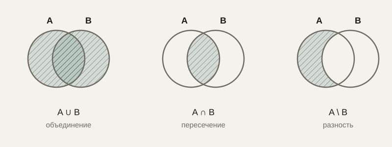

# Множества и логика

До сих пор курс в основном имел дело с непрерывными величинами — числами, которые плавно меняются, функциями, которые можно дифференцировать. Но очень значительная часть программирования — это работа с совсем другим миром: отдельными, дискретными объектами, которые либо принадлежат какой-то группе, либо нет, и утверждениями, которые либо истинны, либо ложны. Этот и следующие три урока посвящены именно такой, дискретной математике.

## Множество

**Множество** — это просто набор различных объектов, без учёта порядка и без повторений. Множество $\{1, 2, 3\}$ — то же самое множество, что и $\{3, 1, 2\}$, а $\{1, 1, 2\}$ на самом деле означает то же самое множество, что и $\{1, 2\}$, потому что в множестве нет понятия «один и тот же элемент дважды».

Эта математическая идея напрямую соответствует типу данных `set` в программировании — и не случайно использует то же самое название:

```python
a = {1, 2, 3}
b = {3, 2, 1, 1}
print(a == b)  # True — множества равны, несмотря на разный порядок записи и повтор
```

## Операции над множествами

**Объединение** двух множеств $A \cup B$ — все элементы, которые входят хотя бы в одно из них. **Пересечение** $A \cap B$ — только те элементы, которые входят в оба множества одновременно. **Разность** $A \setminus B$ — элементы, которые есть в $A$, но отсутствуют в $B$.



```python
a = {1, 2, 3, 4}
b = {3, 4, 5, 6}

print(a | b)  # объединение: {1, 2, 3, 4, 5, 6}
print(a & b)  # пересечение: {3, 4}
print(a - b)  # разность: {1, 2}
```

**Подмножество** $A \subseteq B$ означает, что каждый элемент $A$ также является элементом $B$. Эта идея постоянно используется в анализе данных и в работе с правами доступа: «множество пользователей с правом записи» вполне может быть подмножеством «множества всех зарегистрированных пользователей».

## Зачем множества нужны программисту на практике

Операции над множествами — это не академическое упражнение, а готовое решение целого класса практических задач. Найти общих друзей двух пользователей в социальной сети — это пересечение двух множеств друзей. Найти товары, которые есть в одном складе, но отсутствуют в другом, — это разность множеств. Проверить, что все обязательные поля формы заполнены, — это проверка, что множество заполненных полей является надмножеством множества обязательных. Операции над множествами в большинстве языков программирования реализованы эффективно и выполняются значительно быстрее, чем эквивалентная проверка через циклы и условия, написанная вручную.

## Логика: истина и ложь как значения

**Логическое высказывание** — это утверждение, которое принимает одно из двух значений: истина (True) или ложь (False). Логика изучает, как из простых высказываний строить сложные с помощью логических операций, и как эти сложные высказывания связаны друг с другом.

**Отрицание** ($\neg A$, «не A») переворачивает значение на противоположное. **Конъюнкция** ($A \land B$, «A и B») истинна, только если истинны оба утверждения сразу. **Дизъюнкция** ($A \lor B$, «A или B») истинна, если истинно хотя бы одно из утверждений. Эти три операции — прямые математические родственники логических операторов `not`, `and`, `or`, с которыми программист сталкивается в любом условном операторе:

```python
is_admin = True
has_token = False

can_access = is_admin and has_token
print(can_access)  # False — оба условия должны выполняться
```

## Импликация и эквивалентность

Чуть менее очевидная, но очень важная логическая операция — **импликация** ($A \Rightarrow B$, «если A, то B»). Она ложна только в одном случае — когда $A$ истинно, а $B$ ложно; во всех остальных комбинациях (включая случай, когда $A$ само по себе ложно) импликация считается истинной. Это нередко сбивает с толку на первой встрече: высказывание «если идёт дождь, я беру зонт» формально остаётся истинным даже в солнечный день, когда дождя просто не было — импликация ничего не утверждает про случаи, когда условие не выполнено. **Эквивалентность** ($A \Leftrightarrow B$) истинна, когда $A$ и $B$ имеют одинаковое значение истинности — оба истинны либо оба ложны одновременно.

```text
  A      B    |   A ⟹ B
  истина истина |   истина
  истина ложь   |   ложь
  ложь   истина |   истина
  ложь   ложь   |   истина
```

## Связь с программированием и базами данных

Условные операторы `if`, циклы с условием продолжения `while`, фильтрация данных — всё это напрямую строится на логических высказываниях. Запросы к базам данных почти буквально записывают логику множеств и логических операций на специальном языке: условие `WHERE возраст > 18 AND страна = 'RU'` — это конъюнкция двух логических условий, а объединение результатов двух запросов через `UNION` — прямой аналог объединения множеств.

## Типичные ошибки

Частая ошибка — перепутать `and` и `or` в сложном условии, особенно когда условие записано как отрицание («не сделано ни то, ни другое» требует внимательного применения правил де Моргана — логического тождества, которое связывает отрицание конъюнкции с дизъюнкцией отрицаний, и наоборот). Вторая — забывать, что импликация истинна при ложной посылке, и делать из этого неверный вывод о причинности. Третья — пытаться применить операции множеств к данным, где важен порядок или допустимы повторы, не осознавая, что сам тип данных «множество» эту информацию отбрасывает.

## Что нужно запомнить

Множество — это набор уникальных элементов без учёта порядка, и операции объединения, пересечения и разности напрямую решают множество практических задач программирования эффективнее, чем ручные циклы. Логические операции — отрицание, конъюнкция, дизъюнкция, импликация — формализуют то, как из простых утверждений строятся сложные условия, и эта же формализация лежит в основе условных операторов языков программирования и запросов к базам данных.

## Задачи

1. Даны множества A = {1,2,3,4,5}, B = {3,4,5,6,7}. Найдите A ∪ B, A ∩ B, A \ B и B \ A.
2. Является ли множество {2,4} подмножеством {1,2,3,4,5}? Обоснуйте.
3. Постройте таблицу истинности для выражения (A ∧ B) ∨ ¬A.
4. Упростите логическое выражение ¬(A ∧ B) с помощью правила де Моргана.
5. Запишите условие «пользователь — администратор и у него есть токен доступа» в виде логического выражения.
6. Приведите пример двух множеств данных (например, списков пользователей), для которых операция пересечения решает реальную практическую задачу.
7. Определите истинность импликации «если число делится на 4, то оно делится на 2» и обратной импликации «если число делится на 2, то оно делится на 4». Совпадают ли они по истинности?
8. Сколько элементов в объединении двух множеств из 10 и 7 элементов, если их пересечение состоит из 3 элементов?

## Где это понадобится дальше

В следующем уроке мы перейдём к комбинаторике — разделу, который отвечает на вопрос «сколько существует способов», и который понадобится, чтобы оценивать объём данных, перебор вариантов и сложность алгоритмов.
