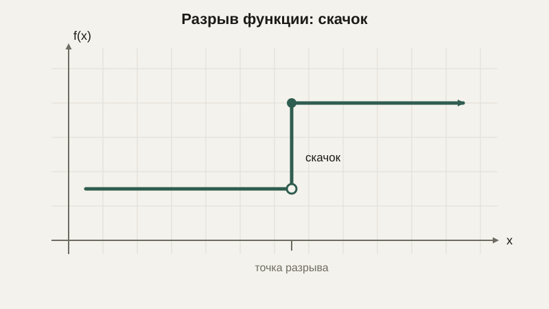

# Предел и непрерывность

До сих пор мы имели дело со статичными объектами: числами, векторами, преобразованиями, которые просто есть. Следующий блок курса — про **изменение**: как величина ведёт себя, когда что-то меняется постепенно, всё более мелкими шагами. Фундамент для этого — понятие предела, и начать стоит не с формального определения, а с интуиции.

## Интуиция: к чему стремится величина

Представим последовательность чисел $1,\; 0.5,\; 0.25,\; 0.125,\; \ldots$ — каждое следующее вдвое меньше предыдущего. Числа никогда не достигнут нуля в буквальном смысле — какое бы число из последовательности мы ни взяли, оно всё ещё положительно. Но интуитивно совершенно ясно, что они **стремятся** к нулю: становятся сколь угодно близкими к нулю, если взять достаточно много шагов. Это и есть предел последовательности — число, к которому значения приближаются неограниченно близко, даже если никогда его буквально не достигают.

```python
x = 1.0
for _ in range(10):
    x = x / 2
    print(x)
# 0.5, 0.25, 0.125, ..., становится всё ближе к 0, но никогда не станет ровно 0
```

## Предел функции в точке

Та же идея применима не только к последовательности чисел, но и к поведению функции вблизи конкретной точки. Рассмотрим функцию

$$
f(x) = \frac{x^2 - 1}{x - 1}
$$

В точке $x = 1$ эта функция формально не определена — и числитель, и знаменатель обращаются в ноль, а делить на ноль нельзя. Но что происходит **рядом** с этой точкой? Если подставлять значения $x$, всё ближе и ближе подбирающиеся к 1 (например, $0.9,\ 0.99,\ 0.999,\ldots$ или $1.1,\ 1.01,\ 1.001,\ldots$), значение функции всё ближе подбирается к числу 2. Записывают это так:

$$
\lim_{x \to 1} \frac{x^2-1}{x-1} = 2
$$

Читается: «предел функции при $x$, стремящемся к 1, равен 2». И здесь кроется ключевая идея всего понятия предела: функция может вести себя предсказуемо и иметь чёткий предел в точке, даже если в самой этой точке она не определена вовсе.

```python
def f(x):
    return (x**2 - 1) / (x - 1)

for x in [0.9, 0.99, 0.999, 1.001, 1.01, 1.1]:
    print(x, f(x))
# Все значения близки к 2.0, хотя f(1) напрямую вычислить нельзя — будет деление на 0
```

На самом деле, почему предел здесь равен именно 2, можно увидеть алгебраически: $\frac{x^2-1}{x-1} = \frac{(x-1)(x+1)}{x-1} = x+1$ при $x \neq 1$ — дробь упрощается, и предел при $x \to 1$ — это просто $1+1=2$. Предел здесь, по сути, формализует то, что интуитивно понятно: если «убрать» одну проблемную точку, функция вполне разумно себя ведёт вокруг неё.

## Непрерывность

Функция называется **непрерывной** в точке, если её предел в этой точке существует и совпадает со значением самой функции в этой точке — иными словами, если в функции нет «разрывов», «скачков» или «дырок». Большинство привычных функций — линейная, квадратичная, синус, косинус — непрерывны везде, где определены. А вот функция вроде «цена доставки» со ступенчатым изменением по весу посылки (до 1 кг — одна цена, от 1 до 2 кг — другая) разрывна в точках, где меняется ставка: предел слева и предел справа от такой точки — разные числа.



## Зачем предел нужен программисту

На первый взгляд предел кажется чисто теоретической конструкцией, нужной лишь для перехода к производной (чем мы и займёмся в следующем уроке). Но сама идея «что происходит при неограниченном приближении» проявляется и напрямую. Алгоритмы, которые постепенно уточняют ответ (например, численный поиск корня уравнения, который мы разберём позже в курсе), на каждом шаге приближаются к истинному значению, никогда не достигая его абсолютно точно — ровно та же идея предела последовательности, с которой мы начали урок. А асимптотическая оценка сложности алгоритмов — разговор о том, как время работы программы ведёт себя при неограниченном росте размера входных данных, — это, по сути, тоже разговор о пределе, просто при $n \to \infty$, а не при приближении к конечной точке.

## Типичные ошибки

Частая ошибка — путать предел функции в точке со значением функции в этой же точке: как мы видели на примере выше, предел может существовать даже там, где саму функцию напрямую вычислить нельзя. Вторая — считать, что если функция не определена в точке, то и предела там точно нет — это неверно, есть множество случаев, когда предел прекрасно существует именно там, где функция формально «не работает». Третья — путать предел со строгим равенством: предел говорит о поведении **рядом** с точкой, а не обязательно о значении точно в ней.

## Что нужно запомнить

Предел описывает, к какому значению стремится величина — последовательность чисел или функция, — когда аргумент неограниченно приближается к некоторой точке, даже если саму эту точку функция не достигает или не определена в ней. Непрерывность функции означает отсутствие разрывов: предел совпадает со значением функции в каждой точке. Идея «неограниченного приближения» лежит в основе практически всех численных методов, с которыми мы познакомимся дальше в курсе.

## Задачи

1. Вычислите lim(x→2) (x² - 4)/(x - 2), сначала упростив выражение алгебраически.
2. Определите, существует ли lim(x→0) sin(x)/x интуитивно (на основе графика, без строгого доказательства) и чему он равен.
3. Приведите пример функции, которая не определена в точке x=1, но имеет предел в этой точке.
4. Приведите пример функции, которая разрывна в точке x=0 (опишите словами или нарисуйте график).
5. Чем предел последовательности отличается от предела функции в точке? Приведите пример каждого.
6. Объясните своими словами, почему асимптотическая оценка алгоритма («при n, стремящемся к бесконечности») — это тоже разговор о пределе.
7. Вычислите lim(x→3) (x² - 9)/(x - 3).

## Где это понадобится дальше

Предел — это именно тот инструмент, который позволит аккуратно определить производную в следующем уроке: скорость изменения функции в точке — это предел того, насколько быстро меняется функция, если брать всё более короткие промежутки вокруг этой точки.
