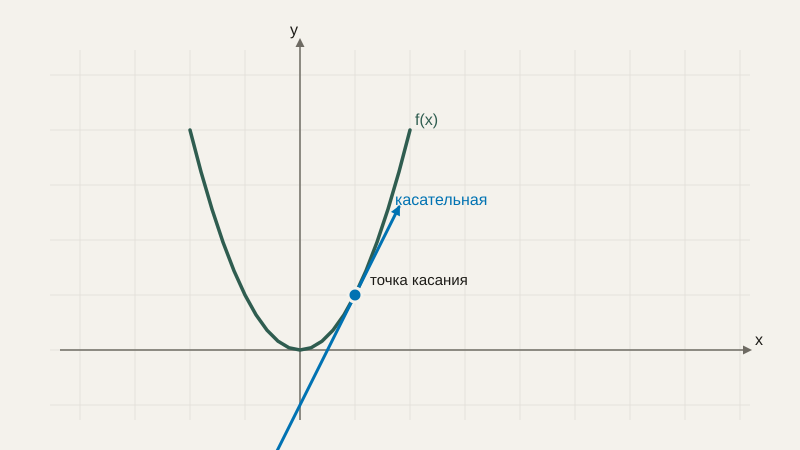
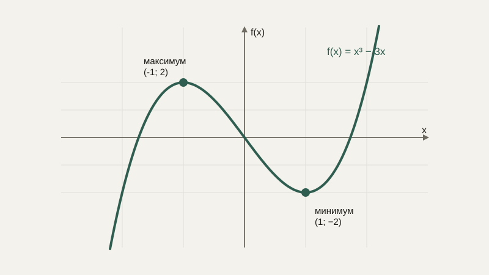

# Производная: правила дифференцирования и экстремумы

Представим робота, который едет по прямой, и известна его координата в каждый момент времени: $x(t)$. Естественный вопрос — с какой скоростью он движется прямо сейчас? Если движение равномерное, ответ простой: скорость — это пройденное расстояние, делённое на затраченное время. Но что, если скорость постоянно меняется — робот разгоняется и тормозит? Чтобы ответить на этот вопрос, нужна производная.

## От средней скорости к мгновенной

Средняя скорость за промежуток времени от $t$ до $t+\Delta t$ — это изменение координаты, делённое на изменение времени:

$$
v_{\text{ср}} = \frac{x(t+\Delta t) - x(t)}{\Delta t}
$$

Это разумное приближение, но оно описывает движение «в среднем» за весь промежуток, а не в конкретный момент $t$. Чтобы получить скорость именно **в момент** $t$, нужно взять этот промежуток времени $\Delta t$ бесконечно малым — применить ровно ту идею предела, с которой мы познакомились в прошлом уроке:

$$
v(t) = \lim_{\Delta t \to 0} \frac{x(t+\Delta t) - x(t)}{\Delta t}
$$

Это и есть **производная** функции $x(t)$ — предел отношения изменения функции к изменению аргумента, когда это изменение аргумента стремится к нулю. Обозначают производную как $x'(t)$ или $\frac{dx}{dt}$.

## Геометрический смысл: наклон касательной

У производной есть и чисто геометрическая интерпретация, не связанная с физикой движения. Если построить график функции $f(x)$, отношение $\frac{f(x+\Delta x)-f(x)}{\Delta x}$ — это наклон прямой, соединяющей две точки графика. Когда $\Delta x$ стремится к нулю, эти две точки сближаются, и прямая, соединяющая их, превращается в **касательную** к графику в данной точке. Производная — это в точности наклон этой касательной.



Это даёт очень практичную интуицию для знака производной: если производная положительна, функция в этой точке растёт (касательная идёт вверх слева направо); если отрицательна — убывает; если равна нулю — в этой точке у функции локальный «плоский участок», часто это вершина или впадина графика. Эта последняя мысль станет ключевой, когда мы перейдём к поиску минимума функции в блоке про оптимизацию.

## Производные основных функций

Для большинства элементарных функций производную не нужно каждый раз выводить через предел — есть таблица готовых правил. Вот несколько самых используемых:

$$
(x^n)' = n x^{n-1} \qquad (\sin x)' = \cos x \qquad (\cos x)' = -\sin x \qquad (e^x)' = e^x
$$

Первое правило — **степенное** — стоит запомнить особенно твёрдо, оно встречается постоянно: например, производная $f(x) = x^2$ равна $f'(x) = 2x$ — именно поэтому касательная к параболе $y=x^2$ в точке $x=3$ имеет наклон $2 \cdot 3 = 6$.

```python
def f(x):
    return x**2

def numerical_derivative(f, x, h=1e-6):
    return (f(x + h) - f(x)) / h

print(numerical_derivative(f, 3))  # примерно 6.0 — совпадает с 2*3 по формуле
```

Функция `numerical_derivative` выше считает производную не по формуле, а напрямую по определению — беря очень маленькое, но не нулевое $\Delta x$ (здесь обозначено `h`). Это так называемое **численное дифференцирование** — грубое, но наглядное подтверждение того, что формула и определение через предел согласуются друг с другом.

## Правила дифференцирования суммы и произведения

Производная суммы функций равна сумме их производных: $(f+g)' = f' + g'$ — это прямое следствие того, что предел суммы равен сумме пределов. Для произведения двух функций правило чуть сложнее — **правило произведения**:

$$
(fg)' = f'g + fg'
$$

Например, для $h(x) = x^2 \sin x$: $h'(x) = 2x\sin x + x^2\cos x$ — производная первого множителя, умноженная на второй, плюс первый множитель, умноженный на производную второго.

## Цепное правило: производная функции от функции

Что если функция составная — одна функция вложена в другую, как мы уже видели в уроке про композицию функций? Например, $h(x) = \sin(x^2)$ — это синус, применённый не к $x$, а к результату $x^2$. Дифференцировать такую функцию напрямую по таблице нельзя — она не является ни простой степенью, ни простым синусом. Для этого существует **цепное правило** (chain rule):

$$
\frac{d}{dx} f(g(x)) = f'(g(x)) \cdot g'(x)
$$

Говоря проще: производная составной функции — это производная «внешней» функции (вычисленная в точке, куда её привела «внутренняя»), умноженная на производную «внутренней» функции. Для нашего примера $h(x) = \sin(x^2)$: внешняя функция — синус, внутренняя — $x^2$, значит $h'(x) = \cos(x^2) \cdot 2x$.

Это правило — не просто ещё одна формула в ряду прочих. Это единственный способ вычислить производную по-настоящему сложной функции, составленной из цепочки простых шагов одна внутри другой — а любая многослойная нейронная сеть устроена ровно так: выход одного слоя становится входом следующего, то есть вся сеть целиком — это одна длинная композиция функций. Алгоритм, который обучает нейросеть (он называется обратным распространением ошибки, backpropagation), — это, по сути, последовательное применение цепного правила слой за слоем, от выхода сети обратно к входу. Понимание цепного правила — не формальность, а прямой ключ к тому, как вообще возможно обучение многослойных моделей.

```python
import math

def h(x):
    return math.sin(x**2)

def h_derivative(x):
    return math.cos(x**2) * 2 * x  # по цепному правилу

print(h_derivative(1))  # cos(1) * 2 ≈ 1.08
```

## Частные производные — короткое предисловие

До сих пор все наши функции зависели только от одной переменной. Но функция ошибки модели машинного обучения обычно зависит сразу от множества параметров — весов модели, которых может быть миллионы. Чтобы понять, как функция меняется при изменении только одного из этих параметров, пока все остальные остаются зафиксированными, используют **частную производную** — производную по одной переменной при фиксированных остальных. Мы вернёмся к частным производным подробно и с полноценными примерами через два урока, когда будем разбирать функции нескольких переменных и градиент — там же мы увидим, как частные производные по каждому параметру собираются вместе в единый вектор.

## Экстремумы: где функция достигает максимума или минимума

Мы уже отмечали, что нулевая производная соответствует «плоскому участку» графика. Разберём это подробнее — именно здесь чаще всего находятся самые интересные точки функции: её наибольшие и наименьшие значения, которые в математике называют **экстремумами**.

Если производная функции положительна на каком-то промежутке, функция там возрастает; если отрицательна — убывает. Точка, где производная меняет знак с плюса на минус, — это **локальный максимум** (функция росла, потом начала убывать — вершина «горки»). Точка, где производная меняет знак с минуса на плюс, — **локальный минимум** (функция убывала, потом начала расти — дно «ямы»).



Найти кандидатов в экстремумы несложно: нужно решить уравнение $f'(x) = 0$ — именно такие точки называют **критическими**, и только они (а не произвольные точки графика) могут оказаться локальным максимумом или минимумом. Чтобы определить, какой именно это тип точки (максимум, минимум или вовсе ни то, ни другое — например, точка перегиба, где производная касается нуля, но знак не меняет), нужно проверить, как меняется знак производной непосредственно до и после этой точки.

Возьмём $f(x) = x^3 - 3x$. Производная: $f'(x) = 3x^2 - 3$. Приравняв к нулю: $3x^2-3=0 \Rightarrow x^2=1 \Rightarrow x=\pm1$. Проверим знак $f'(x)$ левее и правее каждой точки: при $x<-1$ производная положительна (функция растёт), между $-1$ и $1$ — отрицательна (функция убывает), при $x>1$ — снова положительна. Значит, $x=-1$ — локальный максимум, а $x=1$ — локальный минимум.

```python
def f(x):
    return x**3 - 3*x

def f_prime(x):
    return 3*x**2 - 3

for x in [-2, -1, 0, 1, 2]:
    print(x, f_prime(x))
# производная меняет знак ровно в x=-1 и x=1, как мы и нашли вручную
```

Именно поиск точек, где производная равна нулю, — математическая основа практически любой задачи оптимизации: от расчёта оптимальной формы детали с минимальным расходом материала до поиска минимума функции потерь модели машинного обучения, о котором подробно пойдёт речь в блоке численных методов.

## Производная как скорость изменения, не только в физике

Хотя мы начали с примера скорости движения, производная измеряет «скорость изменения» в самом широком смысле — применительно к любой величине, которая зависит от другой. Производная функции издержек по количеству произведённой продукции — это предельная стоимость следующей единицы товара. Производная температуры по времени — скорость нагрева или охлаждения. А та самая функция ошибки, которую пытается минимизировать модель машинного обучения в процессе обучения, — это тоже функция, и её производная по каждому из параметров модели показывает, в какую сторону и насколько сильно нужно подправить этот параметр, чтобы ошибка уменьшилась. Это и есть связующее звено к практическому применению производной, которому посвящён отдельный урок дальше в этом блоке.

## Типичные ошибки

Частая ошибка — путать саму функцию и её производную: производная — это **новая функция**, построенная по исходной, а не число, если только мы явно не подставили конкретную точку. Вторая — забывать правило произведения и дифференцировать произведение функций так же, как сумму, — то есть просто перемножать производные каждого множителя по отдельности, что неверно. Третья, особенно частая при первом знакомстве с цепным правилом, — забыть домножить на производную внутренней функции и продифференцировать только внешнюю, как будто внутри стоит просто $x$. Четвёртая — при численном дифференцировании (как в примере выше) брать `h` слишком маленьким, из-за чего в вычисление вмешиваются уже знакомые нам по предыдущим урокам ошибки округления чисел с плавающей точкой, и результат становится менее точным, а не более.

## Что нужно запомнить

Производная — это предел отношения изменения функции к изменению аргумента при стремлении этого изменения к нулю; она измеряет мгновенную скорость изменения величины и геометрически равна наклону касательной к графику. Положительная производная означает рост функции, отрицательная — убывание, нулевая — локальную «плоскую точку» (к этому мы вернёмся при разговоре об оптимизации). Цепное правило позволяет дифференцировать составные функции — цепочки вложенных друг в друга функций — и является математической основой того, как обучаются многослойные нейронные сети.

## Задачи

1. Найдите производную функции f(x) = 5x³ - 2x + 7.
2. Найдите производную функции f(x) = (x² + 1)(x - 3) с помощью правила произведения.
3. Найдите производную функции f(x) = sin(3x²) с помощью цепного правила.
4. Вычислите значение производной f(x) = x² в точке x = 5.
5. Найдите уравнение касательной к графику f(x) = x² в точке x = 2.
6. Найдите критические точки функции f(x) = x² - 4x + 3 и определите, минимум это или максимум.
7. Найдите критические точки функции f(x) = -x² + 6x и определите их тип.
8. Для f(x) = x³ - 3x найдите интервалы, на которых функция возрастает, и интервалы, на которых убывает.

## Где это понадобится дальше

В следующем уроке мы обобщим производную на функции сразу нескольких переменных и соберём частные производные в единый вектор — градиент, который укажет направление, в котором нужно менять параметры модели, чтобы уменьшить её ошибку. А уже после этого разберём операцию, обратную производной, — интеграл.
