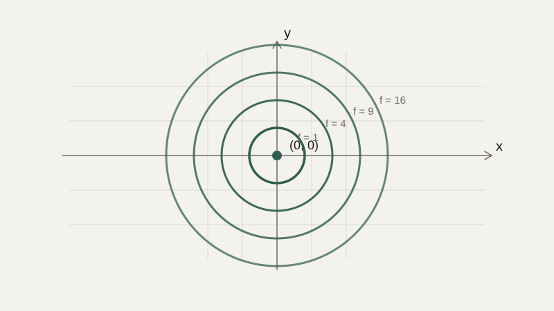

# Функции нескольких переменных и градиент

Все функции, с которыми мы работали в блоке про анализ, зависели от одной переменной — одно число на входе, одно на выходе. Но функция ошибки модели машинного обучения, с которой мы не раз обещали связать производную, обычно зависит сразу от тысяч или миллионов параметров одновременно. Этот урок собирает воедино всё, что нужно для понимания этого куда более общего случая.

## Функция нескольких переменных

**Функция нескольких переменных** принимает на вход не одно число, а сразу несколько — например, $f(x, y) = x^2 + y^2$ зависит одновременно от $x$ и $y$. Если функция одной переменной геометрически изображается кривой линией на плоскости, функция двух переменных естественно изображается **поверхностью** в трёхмерном пространстве: для каждой пары $(x, y)$ значение $f(x,y)$ откладывается по третьей оси, и получается что-то вроде холмистого ландшафта. Функция $f(x, y) = x^2 + y^2$, например, изображается параболоидом — поверхностью, похожей на чашу, с минимумом в точке $(0, 0)$.



## Частные производные

Чтобы понять, как функция меняется, если менять только одну из переменных, оставляя остальные зафиксированными, используют **частную производную** — её мы уже коротко упоминали в уроке про производную. Частная производная по $x$ обозначается $\frac{\partial f}{\partial x}$ и вычисляется ровно как обычная производная по $x$, при этом $y$ временно считается просто константой (и наоборот для частной производной по $y$).

Для $f(x, y) = x^2 + y^2$:

$$
\frac{\partial f}{\partial x} = 2x \qquad \frac{\partial f}{\partial y} = 2y
$$

```python
def f(x, y):
    return x**2 + y**2

def partial_x(f, x, y, h=1e-6):
    return (f(x + h, y) - f(x, y)) / h

def partial_y(f, x, y, h=1e-6):
    return (f(x, y + h) - f(x, y)) / h

print(partial_x(f, 3, 4))  # примерно 6.0 = 2*3
print(partial_y(f, 3, 4))  # примерно 8.0 = 2*4
```

## Градиент: вектор из частных производных

Если собрать все частные производные функции в один вектор, получится **градиент**:

$$
\nabla f = \left( \frac{\partial f}{\partial x},\; \frac{\partial f}{\partial y} \right)
$$

У градиента есть замечательное геометрическое свойство, которое и делает его таким важным: он указывает направление, в котором функция растёт **быстрее всего** из данной точки, а его длина показывает, насколько быстро этот рост происходит. Соответственно, направление **против** градиента — это направление самого быстрого **убывания** функции.

```python
import numpy as np

def gradient(f, x, y, h=1e-6):
    return np.array([partial_x(f, x, y, h), partial_y(f, x, y, h)])

print(gradient(f, 3, 4))  # [6. 8.] — указывает "наружу" от центра чаши
```

Для нашей функции-чаши $f(x,y)=x^2+y^2$ это совершенно согласуется с интуицией: в точке $(3,4)$, которая находится вдали от минимума в $(0,0)$, градиент указывает «наружу», в сторону ещё большего роста — и действительно, чтобы как можно быстрее **уменьшить** значение функции, нужно двигаться в противоположную сторону, то есть к центру чаши.

## Градиент как направление подъёма — и спуска

Представим густой туман и склон холма: не видно ничего, кроме небольшого участка земли прямо под ногами, но нужно найти путь на вершину. Разумная стратегия — на каждом шаге почувствовать, в какую сторону земля поднимается круче всего, и шагнуть именно туда. Градиент — это математически точный аналог этого «направления, куда круче всего поднимается склон» в произвольной точке функции любого числа переменных, не только двух.

Если вместо вершины холма нужно найти, наоборот, дно долины — например, минимум функции ошибки модели, — логика переворачивается: нужно двигаться в направлении, противоположном градиенту, то есть «вниз по склону». Это и есть идея, на которой строится **градиентный спуск** — основной алгоритм обучения в машинном обучении; мы разберём его подробнее уже в блоке про численные методы, а пока достаточно увидеть саму механику: шаг в сторону, обратную градиенту, уменьшает значение функции.

```python
def gradient_descent_step(f, x, y, learning_rate=0.1):
    grad = gradient(f, x, y)
    return x - learning_rate * grad[0], y - learning_rate * grad[1]

x, y = 3.0, 4.0
for _ in range(20):
    x, y = gradient_descent_step(f, x, y)
print(x, y)  # значения всё ближе подбираются к (0, 0) — минимуму функции
```

## Направление наибольшего убывания и критические точки

Точка, в которой градиент равен нулевому вектору (все частные производные равны нулю одновременно), называется **критической точкой** — это обобщение той «плоской точки» на графике функции одной переменной, о которой шла речь в уроке про производную. Критическая точка может оказаться минимумом, максимумом или седловой точкой (минимумом по одному направлению и максимумом по другому, как центр седла) — различить эти случаи детальнее можно, но для этого курса достаточно понимать: там, где градиент обнуляется, функция локально перестаёт расти в любом направлении, и именно такие точки ищет алгоритм оптимизации.

## Типичные ошибки

Частая ошибка — вычислять частную производную, забывая временно «заморозить» остальные переменные, и путать её с обычной (полной) производной. Вторая — путать направление градиента: градиент указывает в сторону **роста**, а для поиска минимума нужно двигаться в **противоположную** сторону — путаница знака здесь довольно частая и трудноуловимая, потому что код продолжает исполняться без ошибок, просто сходится не туда. Третья — забывать, что градиент определён только в конкретной точке и указывает направление **локально**: для сложных, неровных функций с несколькими впадинами движение «вниз по склону» из разных стартовых точек может привести в разные, не обязательно самые глубокие впадины — это ограничение градиентного спуска, о котором ещё пойдёт речь дальше в курсе.

## Что нужно запомнить

Функция нескольких переменных принимает на вход сразу несколько чисел, и её частная производная по одной из переменных показывает, как меняется функция, если менять только эту переменную, оставив остальные фиксированными. Градиент — вектор из всех частных производных — указывает направление самого быстрого роста функции, а движение против градиента — направление самого быстрого убывания. Именно это свойство лежит в основе градиентного спуска — базового алгоритма, которым обучается подавляющее большинство моделей машинного обучения.

## Задачи

1. Для f(x,y) = 3x² + 2y вычислите частные производные ∂f/∂x и ∂f/∂y.
2. Для f(x,y) = x²y + y³ найдите градиент в точке (1, 2).
3. Для f(x,y) = x² + y² найдите точку, в которой градиент равен нулевому вектору.
4. Объясните, в каком направлении нужно двигаться из точки (3, 3), чтобы быстрее всего увеличить значение f(x,y) = x² + y².
5. В каком направлении нужно двигаться из той же точки, чтобы быстрее всего уменьшить значение этой функции?
6. Для f(x,y) = x + y найдите градиент. Зависит ли он от точки (x,y)? Объясните, почему.
7. Приведите пример функции двух переменных, у которой есть и локальный минимум, и локальный максимум одновременно (опишите словесно, без построения точной формулы).

## Где это понадобится дальше

В следующем уроке мы разберём операцию, обратную производной, — интеграл, — а затем перейдём к дифференциальным уравнениям, где производная и градиент появятся уже в описании того, как система меняется во времени. К градиенту мы ещё вернёмся предметно в блоке про численные методы, когда будем разбирать численную оптимизацию во всех деталях.
