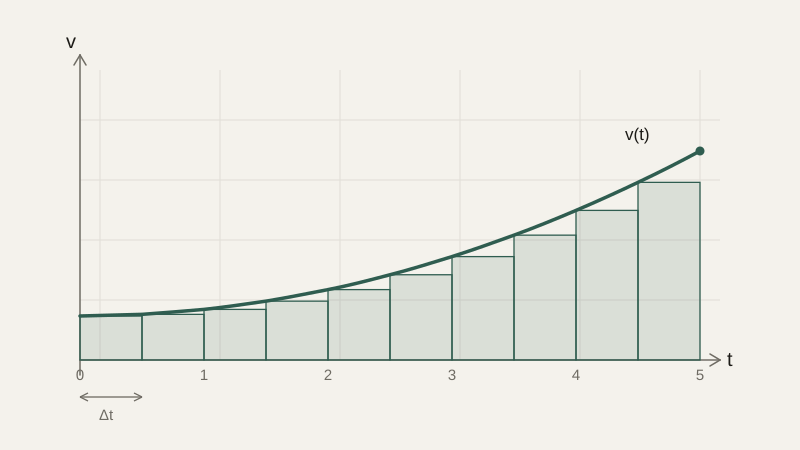

# Интеграл

Несколько уроков назад мы шли от координаты к скорости — находили производную, а затем обобщили её на функции нескольких переменных через градиент. Теперь пойдём в обратную сторону: известна скорость объекта в каждый момент времени, как найти пройденный путь? Эта обратная задача приводит к понятию интеграла — второй фундаментальной операции математического анализа, тесно связанной с производной.

## Накопление и площадь под графиком

Если объект движется с постоянной скоростью $v$ в течение времени $t$, пройденный путь — это просто $v \cdot t$: произведение. Но что, если скорость постоянно меняется? Идея решения — разбить всё время движения на очень много маленьких промежутков, на каждом из которых скорость можно считать примерно постоянной, посчитать пройденный путь на каждом маленьком кусочке как произведение (скорость, умноженная на длительность кусочка), а затем сложить все эти маленькие кусочки пути вместе.

Геометрически скорость как функция времени — это график $v(t)$, а путь на маленьком промежутке — это площадь узкого прямоугольника высотой $v(t)$ и шириной $\Delta t$ под этим графиком. Чем мельче промежутки, тем точнее сумма площадей этих прямоугольников приближает истинную площадь под кривой:



Когда ширина прямоугольников устремляется к нулю (снова та же идея предела, что и в производной), сумма площадей превращается в точную площадь под графиком функции — и это и есть **определённый интеграл**:

$$
\int_a^b v(t)\, dt
$$

Читается: «интеграл от $v(t)$ по $t$ от $a$ до $b$» — именно эта величина равна пройденному пути за промежуток времени от $a$ до $b$, и в общем случае — площади под графиком функции между этими границами.

## Интеграл и производная — взаимно обратные операции

Ключевой факт анализа, который связывает всё, что мы изучили за последние два урока, называют **основной теоремой анализа**: интегрирование и дифференцирование — взаимно обратные операции, почти как умножение и деление или степень и корень. Функцию $F(x)$, производная которой равна исходной функции $f(x)$ (то есть $F'(x) = f(x)$), называют **первообразной** (или неопределённым интегралом) функции $f(x)$.

Например, мы уже знаем, что производная $x^2$ равна $2x$. Значит, первообразная функции $2x$ — это $x^2$ (с точностью до прибавленной константы — производная константы всегда равна нулю, поэтому $x^2 + 5$ тоже годная первообразная для $2x$). В общем виде для степенной функции:

$$
\int x^n\, dx = \frac{x^{n+1}}{n+1} + C
$$

где $C$ — произвольная константа, которую нельзя определить, зная только производную. Определённый интеграл — площадь между конкретными границами $a$ и $b$ — вычисляется через первообразную по формуле Ньютона — Лейбница:

$$
\int_a^b f(x)\, dx = F(b) - F(a)
$$

## Численное интегрирование

Для многих реальных функций (в том числе почти всех, что встречаются в измерениях датчиков, а не в чистой математике) найти аккуратную формулу первообразной невозможно или слишком сложно. На практике интеграл тогда вычисляют приближённо, напрямую по идее «суммы площадей узких прямоугольников», с которой мы начали урок, — это называют **численным интегрированием**.

```python
def numerical_integral(f, a, b, n=1000):
    dx = (b - a) / n
    total = 0
    for i in range(n):
        x = a + i * dx
        total += f(x) * dx
    return total

def v(t):
    return 9.8 * t  # скорость при равноускоренном движении с a = 9.8

print(numerical_integral(v, 0, 2))  # примерно 19.6 — путь за 2 секунды
```

Это ровно тот же принцип, по которому бортовой компьютер робота оценивает пройденный путь, имея только показания датчика скорости, снимаемые через равные короткие промежутки времени, а не аналитическую формулу движения.

## Практические применения

Интеграл появляется везде, где нужно накопить, просуммировать непрерывно меняющуюся величину. Расход заряда батареи — это интеграл потребляемого тока по времени. Общая работа силы — интеграл силы по пройденному расстоянию. В обработке сигналов интеграл используется для сглаживания и для вычисления энергии сигнала. В статистике — которой будет посвящён следующий крупный блок курса — вероятность того, что случайная величина попадёт в определённый диапазон, вычисляется именно как интеграл (площадь) под графиком функции плотности распределения на этом диапазоне.

## Типичные ошибки

Частая ошибка — забывать константу $C$ при вычислении неопределённого интеграла: без дополнительной информации (например, начального условия) первообразную можно восстановить только с точностью до этой произвольной постоянной. Вторая — путать неопределённый интеграл (функцию) и определённый интеграл (число — конкретную площадь между границами). Третья — в численном интегрировании брать слишком маленькое число шагов `n`, что даёт грубое приближение, или, наоборот, слишком большое без необходимости, что просто тратит вычислительные ресурсы впустую на незначительный прирост точности.

## Что нужно запомнить

Определённый интеграл — это площадь под графиком функции, и геометрически он отвечает на вопрос «сколько всего накопилось», если известна скорость изменения в каждый момент. Интегрирование и дифференцирование — взаимно обратные операции: это и есть основная теорема анализа. Там, где аналитическая формула первообразной недоступна или не нужна, интеграл можно вычислить приближённо, напрямую суммируя площади узких прямоугольников, — это особенно полезно при работе с показаниями реальных датчиков.

## Задачи

1. Найдите неопределённый интеграл ∫3x² dx.
2. Найдите неопределённый интеграл ∫(2x + 5) dx.
3. Вычислите определённый интеграл ∫₀² 2x dx и сравните его с площадью под графиком y=2x, вычисленной через площадь треугольника.
4. Скорость объекта задана v(t) = 4t. Найдите пройденный путь за первые 3 секунды.
5. Объясните, почему неопределённый интеграл всегда содержит произвольную константу C, а определённый — нет.
6. Оцените численно (суммой прямоугольников с шириной 0.5) интеграл ∫₀² x² dx и сравните с точным значением, вычисленным по формуле первообразной.
7. Приведите пример физической величины (помимо пути), которая вычисляется как интеграл от другой величины.

## Где это понадобится дальше

Мы прошли предел, производную, градиент и интеграл — весь базовый аппарат анализа функций. В следующем блоке курса мы применим его к системам, которые меняются во времени, — дифференциальным уравнениям, которые как раз и записываются на языке производной.
