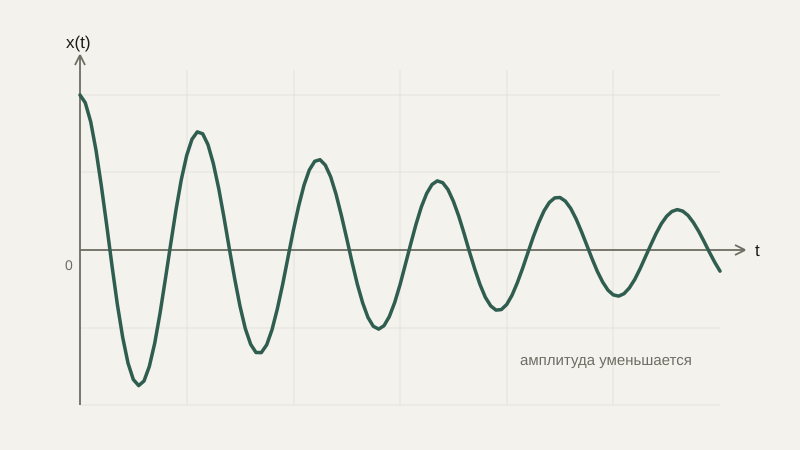

# Уравнения второго порядка и колебания

В прошлом уроке мы работали с уравнениями, где фигурировала только первая производная — скорость изменения величины. Но многие важные физические системы — пружина, маятник, электрический колебательный контур — описываются уравнениями, где участвует и первая производная (скорость), и вторая (ускорение, то есть скорость изменения самой скорости). Такие уравнения называют уравнениями второго порядка, и именно они описывают, пожалуй, самое узнаваемое поведение динамических систем — колебания.

## Вторая производная: ускорение

Мы уже знаем, что если $x(t)$ — положение объекта, то $\frac{dx}{dt}$ — его скорость. Применив производную ещё раз, к уже полученной скорости, получаем **вторую производную** $\frac{d^2x}{dt^2}$ — скорость изменения скорости, то есть **ускорение**. Это прямое продолжение цепочки, которую мы уже упоминали в самом начале блока анализа: положение → скорость → ускорение, где каждая следующая величина — производная от предыдущей.

## Простейшее уравнение второго порядка: пружина без трения

Второй закон Ньютона утверждает, что сила равна массе, умноженной на ускорение: $F=ma$. Для груза на пружине сила со стороны пружины (по закону Гука) пропорциональна смещению от положения равновесия и направлена к нему — чем сильнее растянута пружина, тем сильнее она тянет обратно: $F=-kx$, где $k$ — жёсткость пружины. Подставив это в закон Ньютона, получаем дифференциальное уравнение второго порядка:

$$
m\frac{d^2x}{dt^2} = -kx \qquad \text{или} \qquad \frac{d^2x}{dt^2} = -\omega^2 x, \quad \omega^2 = \frac{k}{m}
$$

Это уравнение **гармонического осциллятора** — одна из самых фундаментальных моделей во всей физике и инженерии, которая, оказывается, описывает не только пружины, но и маятники при малых отклонениях, колебания напряжения в электрической цепи без потерь и даже, в сильно упрощённом виде, вибрации механических конструкций.

## Решение: синус и косинус возвращаются

Решением этого уравнения является функция

$$
x(t) = A\cos(\omega t + \varphi)
$$

где $A$ — амплитуда (максимальное отклонение от равновесия), $\omega$ — угловая частота колебаний (чем больше, тем быстрее колеблется система), а $\varphi$ — начальная фаза, которая вместе с $A$ определяется начальными условиями — положением и скоростью в начальный момент времени, ровно так же, как в прошлом уроке начальное условие выбирало конкретную функцию из целого семейства решений.

```python
import numpy as np
import matplotlib.pyplot as plt

t = np.linspace(0, 10, 300)
A, omega, phi = 2, 1.5, 0

x = A * np.cos(omega * t + phi)
plt.plot(t, x)
plt.show()  # ровная, повторяющаяся волна — то же самое, что мы видели в уроке про тригонометрию
```

Не случайно решение уравнения колебаний — это в точности та же функция косинуса, с которой мы подробно разбирались в блоке про тригонометрию: период обращения точки по окружности и период механического колебания — проявления одной и той же математической структуры, просто в разных физических контекстах.

## Затухающие колебания

Реальная пружина или маятник рано или поздно останавливаются — энергия рассеивается из-за трения или сопротивления воздуха. Добавив в уравнение слагаемое, пропорциональное скорости (сопротивление, подобное тому, что мы видели в прошлом уроке для падающего тела), получаем уравнение **затухающих колебаний**:

$$
\frac{d^2x}{dt^2} + 2\gamma\frac{dx}{dt} + \omega^2 x = 0
$$

Его решение при небольшом затухании — та же колеблющаяся функция, но с амплитудой, которая сама экспоненциально убывает со временем:

$$
x(t) = A e^{-\gamma t}\cos(\omega t + \varphi)
$$



Это, по сути, произведение двух уже знакомых нам решений: экспоненциального затухания из прошлого урока и колебательного движения из этого — красивый пример того, как более простые ранее изученные решения комбинируются для описания более сложного поведения.

## Практические примеры

Подвеска автомобиля спроектирована как раз как система затухающих колебаний: слишком малое затухание ($\gamma$ слишком мало) — машину будет долго «раскачивать» после каждой кочки, слишком большое — подвеска станет слишком жёсткой и будет плохо гасить удары. Электрический LC-контур (катушка индуктивности и конденсатор) без сопротивления колеблется по тому же уравнению гармонического осциллятора, что и механическая пружина, — это снова проявление той же самой математической структуры в совершенно другой физической среде, что и является одной из главных практических ценностей дифференциальных уравнений: одна и та же математика описывает механику, электронику и множество других областей одновременно.

## Типичные ошибки

Частая ошибка — путать угловую частоту $\omega$ (сколько радиан проходится в единицу времени) с обычной частотой колебаний в герцах (сколько полных циклов в секунду) — они связаны соотношением $\omega = 2\pi f$, а не равны друг другу напрямую. Вторая — забывать, что амплитуда и фаза определяются начальными условиями, а не самим уравнением — одно и то же уравнение описывает колебания любой амплитуды. Третья — считать, что любое механическое колебание рано или поздно становится синусоидальным: это верно только для линейных систем вроде пружины при малых отклонениях, а для многих реальных нелинейных систем (например, маятника при больших углах отклонения) точное поведение отличается от простого косинуса.

## Что нужно запомнить

Уравнения второго порядка связывают функцию с её второй производной — ускорением, — и простейший пример, гармонический осциллятор $\frac{d^2x}{dt^2}=-\omega^2 x$, описывает колебания с решением в виде синуса или косинуса. Добавление затухания даёт колебания с экспоненциально убывающей амплитудой — произведение решений, которые мы уже разбирали по отдельности в двух последних уроках. Одна и та же математическая структура описывает механические пружины, маятники и электрические колебательные контуры.

## Задачи

1. Для пружины с жёсткостью k=4 и массой m=1 найдите угловую частоту колебаний ω.
2. Для системы из задачи 1 запишите общее решение x(t), оставив амплитуду A и фазу φ в общем виде.
3. Чему равен период одного полного колебания T, если угловая частота ω = 2 (используйте связь T = 2π/ω)?
4. Объясните, почему при увеличении жёсткости пружины k частота колебаний увеличивается, а при увеличении массы m — уменьшается (опираясь на формулу ω² = k/m).
5. Для затухающих колебаний с коэффициентом затухания γ=0.1 опишите словами, как будет выглядеть график x(t) при увеличении времени.
6. Приведите пример механической или электрической системы (не из урока) и объясните, какая величина в ней играет роль «жёсткости», а какая — «массы».
7. Что произойдёт с решением гармонического осциллятора, если начальная скорость равна нулю, а начальное смещение равно A? Как это повлияет на фазу φ?

## Где это понадобится дальше

Мы нашли аккуратные формулы для простых дифференциальных уравнений, но подавляющее большинство реальных уравнений (особенно нелинейных) не решаются так красиво. В следующем уроке разберём, как находить их решение численно — тем же духом постепенного приближения, которым мы уже пользовались в блоке численных методов применительно к корням уравнений.
