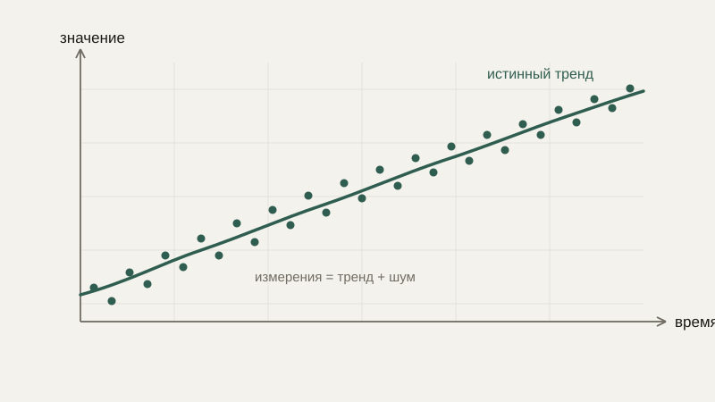

# Последовательности и временные ряды

В блоке про дифференциальные уравнения мы описывали, как величина меняется **непрерывно** — в каждый момент времени. Но данные с реального датчика почти никогда не приходят непрерывным потоком: они поступают отдельными, дискретными замерами — раз в секунду, раз в миллисекунду, раз в час. Этот блок курса посвящён именно такому, дискретному взгляду на изменение во времени.

## Последовательность

**Последовательность** — это упорядоченный, пронумерованный набор чисел: $a_1, a_2, a_3, \ldots$. Мы уже неявно встречались с последовательностями в самом начале курса, когда обсуждали предел — последовательность вроде $1, 0.5, 0.25, 0.125,\ldots$ стремилась к нулю. Последовательность можно задать явной формулой (например, $a_n = \frac{1}{n}$) или **рекуррентно** — через предыдущие члены, как мы уже делали в уроке про рекурсию и индукцию для факториала: $a_n = a_{n-1} \cdot n$.

## Временной ряд

**Временной ряд** — это последовательность значений некоторой величины, измеренных в последовательные моменты **дискретного** времени: показания температурного датчика каждую минуту, курс акции на закрытии каждого торгового дня, скорость вращения колеса робота, снятая энкодером сто раз в секунду. Формально временной ряд — это просто последовательность, но с дополнительным практическим смыслом: индекс $n$ соответствует конкретному моменту времени, а не абстрактному порядковому номеру.

```python
import numpy as np

# Симулируем показания датчика температуры с шумом
t = np.arange(0, 100)
true_trend = 20 + 0.05 * t                     # медленный рост
noise = np.random.normal(0, 1, size=len(t))     # случайный шум датчика
measurements = true_trend + noise

print(measurements[:5])
```

## Тренд и шум

Реальный временной ряд почти никогда не бывает «чистым» — он обычно состоит из настоящей, интересующей нас закономерности (**тренда** — постепенного роста, падения или другой устойчивой тенденции) и наложенного на неё **шума** — случайных колебаний, вызванных погрешностью измерения или мелкими неучтёнными факторами. Мы уже встречали именно эту идею в блоке про вероятность и статистику, когда говорили о нормально распределённом шуме датчика, — здесь та же самая идея применяется не к одному изолированному измерению, а ко всей последовательности измерений во времени.



Разделить тренд и шум — не всегда тривиальная задача, но именно для этого существуют методы сглаживания, о которых пойдёт речь в следующем уроке.

## Изменение между соседними моментами

Простейший способ увидеть, как ведёт себя временной ряд, — посмотреть не на сами значения, а на разности между соседними: $\Delta a_n = a_n - a_{n-1}$. Это дискретный аналог производной, с которой мы работали в непрерывном случае: вместо предела при $\Delta t \to 0$ здесь мы ограничены реальным интервалом между измерениями, который меньше сделать нельзя — он определяется частотой работы датчика.

```python
differences = np.diff(measurements)
print(differences[:5])  # разности между соседними измерениями
```

Если разности в среднем положительны, ряд растёт; если отрицательны — убывает; если колеблются около нуля без явной тенденции — величина в среднем стабильна, и то, что мы видим, — преимущественно шум.

## Практические примеры

Телеметрия робота — классический временной ряд: положение, скорость, показания батареи, температура контроллера — всё это записывается через равные промежутки времени и образует последовательность, по которой можно отследить, например, постепенную разрядку батареи (тренд) на фоне случайных колебаний напряжения под нагрузкой (шум). Данные вибрации промышленного оборудования, биржевые котировки, показания пульса — всё это точно такие же временные ряды, просто с совершенно разным физическим смыслом.

## Типичные ошибки

Частая ошибка — путать тренд с конкретным значением в моменте: случайный всплеск одного измерения — это, скорее всего, шум, а не признак изменения тренда, и делать выводы по одной точке опасно. Вторая — забывать, что интервал между измерениями (частота дискретизации, к которой мы вернёмся подробнее через урок) ограничивает, насколько быстрые изменения вообще можно заметить во временном ряде — то, что происходит быстрее, чем интервал между соседними замерами, попросту «теряется». Третья — анализировать временной ряд так, будто его значения независимы друг от друга, хотя соседние измерения почти всегда связаны: значение датчика температуры в следующую секунду обычно близко к значению в текущую, а не выбирается заново «с нуля», как в независимых случайных событиях из блока про вероятность.

## Что нужно запомнить

Последовательность — упорядоченный набор чисел, а временной ряд — последовательность значений, измеренных в равные моменты дискретного времени. Реальный временной ряд обычно состоит из тренда (закономерности) и шума (случайных колебаний), и разности между соседними значениями — дискретный аналог производной, показывающий скорость изменения величины между измерениями.

## Задачи

1. Дана последовательность 2, 4, 6, 8, 10. Найдите формулу общего члена $a_n$.
2. Дана рекуррентная последовательность $a_1=1$, $a_n = a_{n-1} + 2n$. Найдите $a_2$, $a_3$, $a_4$.
3. Для временного ряда [10, 12, 11, 15, 14, 18] найдите разности между соседними значениями.
4. По разностям из задачи 3 определите, растёт ряд в среднем, убывает или колеблется без тренда.
5. Приведите пример временного ряда из своей предметной области (робототехника, датчики, финансы — на выбор) и опишите, что в нём, вероятно, тренд, а что — шум.
6. Объясните, почему разность соседних значений временного ряда — это именно дискретный аналог производной, а не что-то принципиально другое.
7. Датчик измеряет величину раз в секунду. Объясните, почему изменение, произошедшее и полностью завершившееся за 0.1 секунды, скорее всего, не будет корректно отражено в этом временном ряде.

## Где это понадобится дальше

Теперь, когда мы умеем смотреть на временной ряд и различать тренд с шумом на глаз, разберём конкретный практический инструмент, который делает это автоматически и количественно, — скользящее окно и сглаживание.
