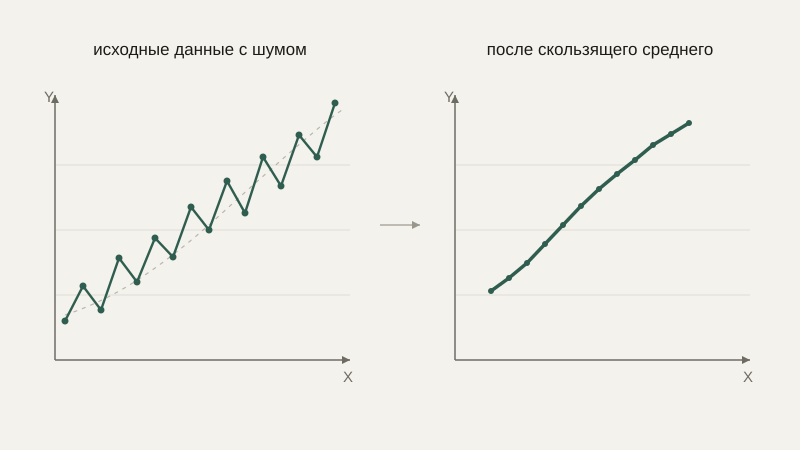

# Скользящее окно и сглаживание сигналов

В прошлом уроке мы увидели на глаз, что реальный временной ряд состоит из тренда и шума. Теперь разберём конкретный, практический инструмент, который разделяет их не на глаз, а вычислительно, — скользящее окно, и построенное на нём сглаживание.

## Идея скользящего окна

**Скользящее окно** — это способ вычислить какую-то характеристику (чаще всего — среднее) не по всему ряду сразу, а по небольшому, фиксированного размера «куску» последних значений, который сдвигается на каждом новом шаге. Если окно имеет размер 3, то для каждой позиции $n$ вычисляется среднее значений $a_{n-2}, a_{n-1}, a_n$ — трёх последних замеров, включая текущий.

```text
   ряд:      [10, 12, 11, 15, 14, 18]
   окно=3:
   позиция 3:  (10+12+11)/3 = 11.0
   позиция 4:  (12+11+15)/3 = 12.67
   позиция 5:  (11+15+14)/3 = 13.33
   позиция 6:  (15+14+18)/3 = 15.67
```

```python
def moving_average(data, window):
    result = []
    for i in range(window - 1, len(data)):
        window_slice = data[i - window + 1 : i + 1]
        result.append(sum(window_slice) / window)
    return result

data = [10, 12, 11, 15, 14, 18]
print(moving_average(data, window=3))  # [11.0, 12.67, 13.33, 15.67]
```

## Почему это сглаживает шум

Мы уже знаем из блока про вероятность и статистику, что усреднение нескольких независимых измерений уменьшает влияние случайного шума — положительные и отрицательные отклонения от истинного значения частично взаимно гасятся при суммировании. Скользящее окно — это ровно это же усреднение, только применённое не ко всем данным сразу (что убило бы и тренд, превратив весь ряд в одно число), а локально, к небольшому соседнему участку, — поэтому общая, более медленная тенденция (тренд) сохраняется, а быстрые, хаотичные колебания (шум) сглаживаются.



## Размер окна: компромисс между сглаживанием и запаздыванием

Выбор размера окна — ключевое практическое решение, и здесь, как и почти везде в этом курсе, есть компромисс. Маленькое окно слабо сглаживает шум — в результате почти всё хаотичное дрожание остаётся. Большое окно сглаживает сильнее, но ценой **запаздывания**: поскольку каждое значение сглаженного ряда — это среднее по нескольким предыдущим точкам, оно реагирует на настоящие, резкие изменения тренда с задержкой — тем большей, чем больше окно. Для системы управления роботом в реальном времени это критично: слишком большое окно сглаживания показаний датчика сделает систему медленно реагирующей на реальные, быстрые изменения обстановки, что может быть не менее опасно, чем необработанный шум.

```python
import numpy as np

data = np.array([10, 12, 11, 15, 14, 30, 14, 15])  # резкий скачок на позиции 5

print(moving_average(list(data), window=2))  # быстро реагирует на скачок
print(moving_average(list(data), window=5))  # сильно сглаживает, но реагирует с запозданием
```

## Другие виды сглаживания

Простое скользящее среднее придаёт всем точкам внутри окна одинаковый вес. **Экспоненциальное сглаживание** — чуть более продвинутый, но очень практичный вариант: оно придаёт больший вес более свежим значениям и экспоненциально уменьшающийся вес более старым, не требуя хранить целое окно прошлых значений — хватает всего одного предыдущего сглаженного значения и нового замера:

$$
s_n = \alpha \cdot a_n + (1-\alpha) \cdot s_{n-1}
$$

где $\alpha$ (от 0 до 1) определяет, насколько быстро сглаженное значение «забывает» старые данные в пользу новых — чем ближе $\alpha$ к 1, тем меньше сглаживания и быстрее реакция; чем ближе к 0, тем сильнее сглаживание и больше запаздывание. Эта формула — рекуррентная последовательность в точности в том смысле, который мы разобрали в прошлом уроке: каждое следующее значение строится из предыдущего.

```python
def exponential_smoothing(data, alpha):
    smoothed = [data[0]]
    for value in data[1:]:
        smoothed.append(alpha * value + (1 - alpha) * smoothed[-1])
    return smoothed

print(exponential_smoothing([10, 12, 11, 15, 14, 30, 14, 15], alpha=0.3))
```

## Практическое применение

Сглаживание показаний энкодера колеса робота убирает дрожание, вызванное механическими вибрациями, не теряя реальную тенденцию изменения скорости. Биржевые графики почти всегда показывают скользящее среднее поверх необработанных котировок — именно чтобы отделить реальный тренд от ежеминутного шума торгов. Сглаживание температурных данных убирает случайные выбросы отдельных измерений, сохраняя настоящую динамику нагрева или охлаждения.

## Типичные ошибки

Частая ошибка — выбрать окно сглаживания «на глаз», не проверив, насколько сильно это искажает реакцию системы на реальные быстрые изменения, особенно в системах реального времени вроде управления роботом. Вторая — применить сглаживание, а затем использовать сглаженные данные там, где нужна именно скорость реакции на свежее измерение (например, в контуре аварийной остановки) — задержка, вносимая сглаживанием, там может быть недопустима. Третья — путать сглаживание с полным устранением шума: скользящее среднее уменьшает влияние шума, но не убирает его полностью, особенно на границах резких, настоящих изменений тренда.

## Что нужно запомнить

Скользящее окно вычисляет среднее по небольшому, сдвигающемуся набору последних значений, сглаживая случайный шум и сохраняя более медленный тренд. Размер окна — компромисс между силой сглаживания и запаздыванием реакции на реальные изменения. Экспоненциальное сглаживание — более гибкая альтернатива, взвешивающая недавние значения сильнее старых, без необходимости хранить целое окно данных.

## Задачи

1. Для ряда [5, 7, 6, 9, 8, 12] вычислите скользящее среднее с окном 2.
2. Для того же ряда вычислите скользящее среднее с окном 3.
3. Сравните результаты задач 1 и 2: какое окно сильнее сглаживает колебания?
4. Для ряда [10, 10, 10, 10, 50, 10, 10] (резкий одиночный выброс) вычислите скользящее среднее с окном 3 и опишите, как выброс повлияет на результат вокруг него.
5. Вычислите вручную два шага экспоненциального сглаживания для ряда [20, 25, 22] с α=0.5, начиная s₁=20.
6. Объясните, почему при α=1 в формуле экспоненциального сглаживания результат просто совпадает с исходными данными без всякого сглаживания.
7. Система управления роботом должна реагировать на изменение показаний датчика препятствия в пределах 50 мс. Обоснуйте, почему скользящее окно размером в 2 секунды для этого датчика было бы плохим выбором.

## Где это понадобится дальше

Мы научились сглаживать сигнал, убирая высокочастотный шум. В следующем, последнем уроке этого блока разберём, что вообще значит «частота» применительно к сигналу, и познакомимся с базовой идеей того, как сигнал раскладывается на составляющие его периодические колебания.
