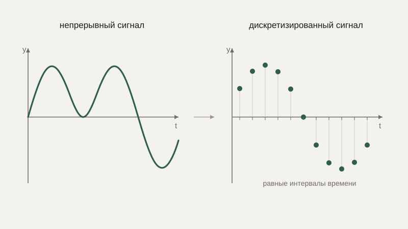
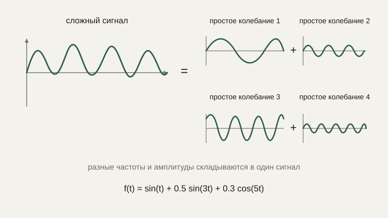

# Период, частота и идея спектрального представления

Мы научились сглаживать сигнал и убирать быстрый, хаотичный шум. Но что, если интересующая нас часть сигнала сама по себе — это не плавный тренд, а регулярное, периодическое колебание, вроде вибрации двигателя или звуковой волны? Для таких сигналов полезен другой взгляд — не «что происходит в каждый момент времени», а «из каких по-разному быстрых колебаний состоит весь сигнал в целом».

## Период и частота

Мы уже встречали **период** в блоке про тригонометрию — промежуток времени (или угол), после которого функция в точности повторяет своё поведение. Для сигнала, периодически меняющегося во времени, период $T$ измеряется в единицах времени (например, секундах). **Частота** $f$ — обратная величина, показывающая, сколько полных периодов укладывается в одну секунду:

$$
f = \frac{1}{T}
$$

Частота измеряется в герцах (Гц) — один герц означает одно полное колебание в секунду. Угловая частота $\omega$, с которой мы уже работали в уроке про колебания, связана с обычной частотой простым соотношением $\omega = 2\pi f$ — этот коэффициент $2\pi$ просто переводит «число колебаний в секунду» в «число радиан в секунду», так же как мы переводили градусы в радианы в блоке про тригонометрию.

```python
import numpy as np

frequency = 5  # Гц
t = np.linspace(0, 1, 1000)
signal = np.sin(2 * np.pi * frequency * t)  # 5 полных колебаний за 1 секунду
```

## Дискретизация: переход от непрерывного сигнала к последовательности чисел

Реальный физический сигнал — звук, вибрация, электрический ток — непрерывен. Но компьютер и цифровой датчик могут хранить только конечный набор отдельных чисел, поэтому сигнал **дискретизируют** — измеряют его значение через равные, достаточно короткие промежутки времени, превращая непрерывную кривую в тот самый временной ряд, с которым мы работали в начале этого блока. **Частота дискретизации** — это сколько таких измерений делается за секунду (тоже в герцах).



Здесь возникает критически важное практическое ограничение, которое мы лишь затрагивали в уроке про временные ряды: чтобы корректно «увидеть» колебание определённой частоты, частота дискретизации должна быть **значительно выше** частоты самого колебания — на интуитивном уровне, если измерять значение быстро меняющейся величины слишком редко, можно вообще пропустить сами колебания между соседними замерами, а то и принять быстрый сигнал за медленный, в корне ошибочно истолковав данные. Именно поэтому, например, частота дискретизации звука на аудио CD (44 100 Гц) заметно выше максимальной частоты, которую способно слышать человеческое ухо (около 20 000 Гц) — с запасом, чтобы корректно улавливать даже самые высокие слышимые частоты.

## Идея спектрального представления

До сих пор мы смотрели на сигнал как на функцию времени: какое значение в какой момент. Но есть и принципиально другой, не менее полезный взгляд — посмотреть на сигнал как на **сумму нескольких простых периодических колебаний разной частоты**, каждое со своей амплитудой. Оказывается (и это один из самых красивых и мощных фактов во всей прикладной математике, хотя строгое доказательство выходит далеко за рамки этого курса), практически любой разумный периодический сигнал можно представить как сумму синусов и косинусов разных частот — такое представление называют **спектром** сигнала.



Спектр показывает не «что происходит в момент времени $t$», а «сколько в сигнале колебаний каждой конкретной частоты» — это принципиально другой, но не менее информативный разрез тех же самых данных. Преобразование, которое переводит сигнал из представления «значение по времени» в представление «амплитуда по частотам», называется преобразованием Фурье; мы намеренно не разбираем его формулу подробно в этом курсе — это уже отдельная большая тема, — но сама идея «сигнал = сумма простых периодических колебаний разных частот» стоит того, чтобы её понимать концептуально уже сейчас.

## Зачем это нужно на практике

Спектральное представление — это именно то, что отвечает на вопрос «на какой частоте вибрирует неисправный подшипник» в промышленной диагностике оборудования — конкретная неисправность обычно даёт характерный, узнаваемый всплеск на определённой частоте в спектре вибрации, который плохо заметен в обычном графике «значение от времени», зато отчётливо виден на графике «амплитуда от частоты». Сжатие звука и изображений (форматы вроде MP3 или JPEG) тоже опирается на спектральное представление: человеческое восприятие менее чувствительно к определённым частотам, и эти частоты можно закодировать с меньшей точностью, заметно уменьшив размер файла почти без потери субъективного качества.

## Типичные ошибки

Частая ошибка — путать период и частоту, забывая, что они обратны друг другу, а не равны. Вторая — выбирать частоту дискретизации сигнала «на глаз», не учитывая максимальную частоту колебаний, которую нужно корректно зарегистрировать, что приводит к искажённым или полностью пропущенным быстрым изменениям. Третья — считать, что спектральное представление «теряет» информацию о времени: оно лишь по-другому её организует, и исходный сигнал в принципе можно восстановить обратно из его спектра, если сохранить всю информацию об амплитудах и фазах.

## Что нужно запомнить

Период и частота — обратные друг другу характеристики периодического сигнала, а дискретизация превращает непрерывный сигнал в последовательность отдельных измерений, частота которой должна быть заметно выше частоты самого измеряемого колебания. Спектральное представление показывает, из колебаний каких частот состоит сигнал, — принципиально другой, но не менее содержательный взгляд на те же данные, который лежит в основе диагностики оборудования по вибрации и сжатия звука и изображений.

## Задачи

1. Сигнал совершает одно полное колебание за 0.02 секунды. Найдите его частоту в герцах.
2. Сигнал имеет частоту 50 Гц. Найдите его период.
3. Найдите угловую частоту ω для сигнала с частотой 10 Гц.
4. Объясните, почему для корректной регистрации сигнала частотой 100 Гц частота дискретизации 120 Гц была бы рискованным выбором, а 1000 Гц — надёжным.
5. Приведите пример (словесно) ситуации из робототехники или электроники, где слишком низкая частота дискретизации привела бы к неверной интерпретации данных.
6. Объясните своими словами разницу между графиком «значение сигнала от времени» и графиком «амплитуда от частоты» для одного и того же сигнала.
7. Почему диагностика неисправности подшипника по спектру вибрации может быть удобнее, чем просто разглядывание графика вибрации во времени?

## Где это понадобится дальше

На этом блок временных рядов и сигналов завершён. В следующем блоке курса мы вернёмся к вероятности и статистике — на этот раз применительно к уже готовым, собранным наборам данных, а не к сигналам, меняющимся во времени.
