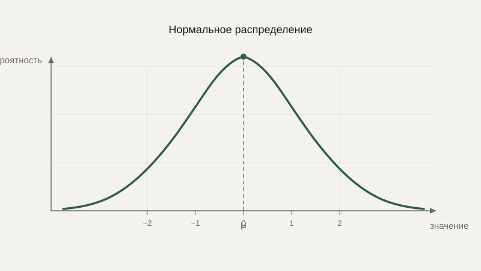

# Случайные величины и распределения

В прошлом уроке мы говорили об отдельных событиях — выпал орёл, тест положителен. Но часто удобнее говорить не о событии, а о числе, которое зависит от случайного исхода: сумма очков на двух кубиках, время отклика сервера, ошибка показаний датчика. Такое число называют случайной величиной, и у каждой случайной величины есть своё характерное «поведение» — распределение.

## Случайная величина

**Случайная величина** — это числовая характеристика случайного эксперимента: не сам исход, а число, которое мы с ним связываем. Бросок кубика — случайный эксперимент, а «выпавшее число» — случайная величина, которая может принять любое из значений $1,\ldots,6$, каждое с определённой вероятностью. Случайные величины бывают **дискретными** (принимают отдельные, перечислимые значения, как результат броска кубика) и **непрерывными** (могут принять любое значение из промежутка, как рост человека или время ожидания).

## Математическое ожидание: среднее значение в долгосрочной перспективе

**Математическое ожидание** случайной величины — это среднее значение, которое она принимает, если повторять эксперимент очень много раз, взвешенное по вероятности каждого исхода:

$$
E[X] = \sum_i x_i \cdot P(x_i)
$$

Для честного шестигранного кубика: $E[X] = 1\cdot\frac16 + 2\cdot\frac16 + \ldots + 6\cdot\frac16 = 3.5$ — заметьте, само число 3.5 никогда не выпадает ни на одном броске, но это именно то число, вокруг которого группируется среднее очень многих бросков.

```python
import random

def simulate_mean(trials=100000):
    rolls = [random.randint(1, 6) for _ in range(trials)]
    return sum(rolls) / len(rolls)

print(simulate_mean())  # число, близкое к 3.5
```

## Дисперсия и стандартное отклонение: насколько сильно разбросаны значения

Математическое ожидание ничего не говорит о том, насколько сильно отдельные значения отклоняются от среднего. Для этого используют **дисперсию** — среднее значение квадрата отклонения от математического ожидания:

$$
\text{Var}(X) = E[(X - E[X])^2]
$$

Квадрат отклонения берётся не случайно: без него положительные и отрицательные отклонения от среднего взаимно гасили бы друг друга при суммировании, давая в сумме обманчивый ноль, даже если разброс значений на самом деле огромен. Квадрат делает все отклонения положительными — а заодно сильнее штрафует большие отклонения, чем маленькие.

Поскольку дисперсия измеряется в «квадратных единицах» исходной величины (например, в квадратных сантиметрах, если сама величина — рост в сантиметрах), для практического удобства чаще используют **стандартное отклонение** — просто квадратный корень из дисперсии, возвращающий результат к исходным, понятным единицам измерения:

$$
\sigma = \sqrt{\text{Var}(X)}
$$

```python
def variance(values):
    mean = sum(values) / len(values)
    return sum((x - mean) ** 2 for x in values) / len(values)

import math
data = [2, 4, 4, 4, 5, 5, 7, 9]
print(variance(data), math.sqrt(variance(data)))  # дисперсия и стандартное отклонение
```

## Нормальное распределение

Среди всех возможных распределений особое место занимает **нормальное распределение** (также известное как гауссово или «колоколообразная кривая») — оно описывает огромное количество реальных величин: ошибки измерения, рост людей, шум в электронных датчиках. Причина такой универсальности — так называемая центральная предельная теорема: сумма или среднее большого числа независимых случайных факторов, каждый из которых вносит небольшой вклад, стремится именно к нормальному распределению, какими бы ни были распределения отдельных слагаемых.



Нормальное распределение полностью описывается всего двумя числами — средним $\mu$ (центром «колокола») и стандартным отклонением $\sigma$ (шириной «колокола»): примерно 68% значений попадают в диапазон $\mu \pm \sigma$, около 95% — в диапазон $\mu \pm 2\sigma$. Это правило — одно из самых практически используемых во всей статистике: оно сразу даёт грубую, но надёжную оценку, какой разброс значений «нормален», а какой уже аномален.

```python
import random

noise = [random.gauss(0, 1) for _ in range(10000)]  # нормальный шум, μ=0, σ=1
print(sum(1 for x in noise if abs(x) <= 1) / len(noise))  # примерно 0.68
```

## Практическое применение: шум и погрешность

Показания почти любого реального датчика — не точное значение измеряемой величины, а это значение плюс случайный шум, чаще всего приближённо нормально распределённый. Понимание этого напрямую влияет на инженерные решения: усреднение нескольких измерений уменьшает влияние случайного шума (потому что положительные и отрицательные отклонения от истинного значения при усреднении частично взаимно гасятся), а знание стандартного отклонения датчика позволяет заранее заложить в систему допустимый диапазон погрешности, а не считать любое отклонение от ожидаемого значения поломкой.

## Типичные ошибки

Частая ошибка — путать математическое ожидание с «типичным», наиболее вероятным значением: для несимметричных распределений среднее и самое частое значение (его называют модой) могут заметно различаться. Вторая — забывать, что дисперсия измеряется в квадратных единицах, и напрямую сравнивать её со стандартным отклонением или с самой величиной — это сравнение разных единиц измерения. Третья — автоматически предполагать нормальное распределение там, где реальные данные ему не следуют (например, распределение доходов людей или размеров файлов в файловой системе обычно сильно несимметрично) — правило «68–95» просто неприменимо для таких распределений без дополнительных оговорок.

## Что нужно запомнить

Случайная величина — это число, зависящее от случайного исхода, а математическое ожидание — её среднее значение в долгосрочной перспективе. Дисперсия и стандартное отклонение измеряют, насколько сильно значения разбросаны вокруг среднего. Нормальное распределение — особенно частый и практически важный случай, который естественно возникает, когда случайная величина складывается из множества мелких независимых случайных факторов, и его легко описать всего двумя числами — средним и стандартным отклонением.

## Задачи

1. Найдите математическое ожидание результата броска шестигранного кубика.
2. Для набора данных [2, 4, 4, 4, 5, 5, 7, 9] вычислите среднее значение.
3. Для того же набора данных вычислите дисперсию.
4. Вычислите стандартное отклонение для того же набора данных.
5. Случайная величина имеет нормальное распределение со средним 50 и стандартным отклонением 5. В каком диапазоне находится примерно 68% значений?
6. В каком диапазоне находится примерно 95% значений для той же случайной величины?
7. Объясните, почему дисперсия всегда неотрицательна.
8. Приведите пример дискретной и пример непрерывной случайной величины из повседневной жизни.

## Где это понадобится дальше

В следующем уроке мы спустимся с абстрактных распределений к работе с реальными, уже собранными наборами данных — и увидим, как те же самые идеи среднего и разброса применяются на практике в статистике и анализе данных.
