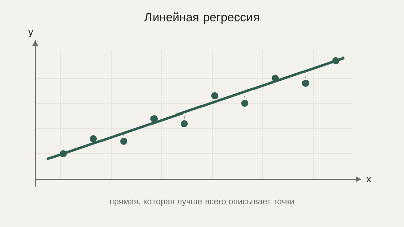
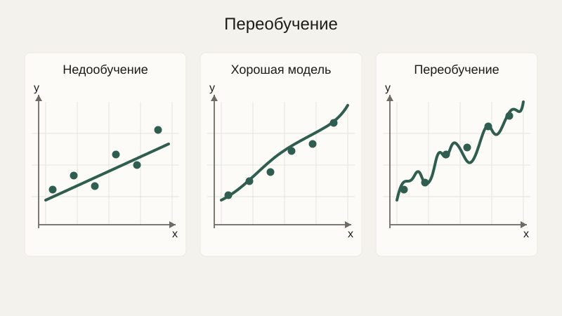

# Корреляция и регрессия

В прошлом уроке мы научились измерять, насколько две величины связаны между собой, через коэффициент корреляции. Но часто хочется не просто узнать «насколько сильно связаны», а получить конкретный инструмент предсказания: «если известен возраст дома, какова ожидаемая его цена?» Для этого нужен следующий шаг — регрессия, которая строит по данным конкретную формулу зависимости.

## Линейная регрессия: подбор прямой по точкам

**Линейная регрессия** ищет такую прямую $y = kx + b$ (вспомним линейную функцию из блока про алгебру), которая наилучшим образом описывает связь между набором точек данных. «Наилучшим образом» здесь имеет точный математический смысл — и для его объяснения понадобится идея, которую мы уже видели в блоке про оптимизацию: минимизация некоторой функции ошибки.



## Метод наименьших квадратов

Для каждой точки данных $(x_i, y_i)$ прямая $y = kx+b$ предсказывает значение $kx_i + b$, которое, скорее всего, не совпадёт в точности с реальным $y_i$ — разницу между ними называют **остатком** (или ошибкой предсказания для этой конкретной точки): $y_i - (kx_i + b)$. **Метод наименьших квадратов** подбирает такие $k$ и $b$, которые минимизируют сумму **квадратов** этих остатков по всем точкам сразу:

$$
\text{Ошибка}(k, b) = \sum_i \left( y_i - (kx_i + b) \right)^2
$$

Квадрат здесь используется по той же причине, что и в дисперсии из предыдущего урока: он делает все отклонения положительными (не давая положительным и отрицательным ошибкам взаимно гаситься при суммировании) и сильнее штрафует большие ошибки, чем маленькие. А минимизация этой суммы — именно та задача, для которой нужен был градиент, с которым мы познакомились в блоке про анализ: лучшие $k$ и $b$ находятся там, где частные производные ошибки по $k$ и по $b$ одновременно обращаются в ноль.

```python
import numpy as np

hours_studied = np.array([1, 2, 3, 4, 5])
exam_score = np.array([50, 55, 65, 70, 85])

k, b = np.polyfit(hours_studied, exam_score, deg=1)
print(f"y = {k:.2f}x + {b:.2f}")

predicted = k * 6 + b
print(predicted)  # предсказанный результат для 6 часов подготовки
```

Функция `np.polyfit` с `deg=1` решает именно ту задачу минимизации, что описана формулой выше, не заставляя нас выводить решение вручную — но важно понимать, какая именно задача решается «под капотом», чтобы не воспринимать регрессию как чёрный ящик.

## Регрессия как прогнозирование

Главная практическая ценность регрессии — не столько описать уже имеющиеся данные, сколько **предсказать** значение для новых, ещё не виденных входных данных: сколько часов подготовки нужно для желаемого результата экзамена, какой будет цена квартиры с заданной площадью, как изменится спрос на товар при изменении цены. Это первый, самый простой пример того, что на более общем языке называют моделью машинного обучения: функция, параметры которой ($k$ и $b$ в нашем случае) подбираются по имеющимся данным так, чтобы минимизировать ошибку предсказания, а затем применяются к новым данным.

## Переобучение: когда модель слишком хорошо подстраивается под данные

Если вместо прямой линии подбирать кривую более высокой степени — параболу, кубическую кривую и так далее, — можно добиться всё более точного совпадения с имеющимися точками данных, вплоть до прохождения ровно через каждую точку. Но это не всегда хорошо: слишком гибкая кривая начинает повторять не только настоящую закономерность в данных, но и случайный шум, которым неизбежно «загрязнены» любые реальные измерения. В результате такая кривая прекрасно описывает уже виденные данные, но плохо предсказывает новые — это явление называют **переобучением**, и оно — одна из центральных проблем, с которой придётся иметь дело в любом серьёзном курсе машинного обучения.



## Типичные ошибки

Частая ошибка — автоматически строить линейную регрессию там, где реальная зависимость явно не линейна (например, экспоненциальный рост), получая формально корректную, но практически бесполезную прямую. Вторая — предсказывать значения далеко за пределами диапазона исходных данных (**экстраполяция**): модель, хорошо описывающая данные от 1 до 5 часов подготовки, может быть совершенно неверна для 50 часов — там просто нет никакой гарантии, что линейная зависимость сохранится. Третья — путать хорошее совпадение с данными (низкую ошибку на уже виденных точках) с хорошим качеством предсказания новых данных — именно об этой ловушке и предупреждает идея переобучения.

## Что нужно запомнить

Линейная регрессия подбирает прямую, которая наилучшим образом описывает связь между величинами, минимизируя сумму квадратов отклонений предсказаний от реальных значений — это и есть метод наименьших квадратов. Регрессия даёт конкретный инструмент прогнозирования, а не только меру связи, как корреляция. Чрезмерно гибкая модель рискует подстроиться под случайный шум в данных (переобучение), что ухудшает, а не улучшает качество предсказания новых данных.

## Задачи

1. По точкам (1,2), (2,4), (3,6) определите на глаз уравнение прямой линейной регрессии.
2. Используя найденное уравнение из задачи 1, предскажите значение y при x=10.
3. Объясните своими словами, что минимизирует метод наименьших квадратов.
4. Почему в методе наименьших квадратов отклонения возводят в квадрат, а не берут по модулю?
5. Приведите пример ситуации, где линейная регрессия даст плохое предсказание из-за нелинейной природы зависимости.
6. Объясните на примере, почему экстраполяция далеко за пределы диапазона исходных данных рискованна.
7. Что такое переобучение регрессионной модели и как оно проявляется на графике предсказаний?

## Где это понадобится дальше

На этом блок вероятности и статистики завершён. Следующий блок курса переключится на дискретную математику — множества, логику, комбинаторику и графы, — которые понадобятся для понимания алгоритмов и структур данных, а не столько для анализа непрерывных величин.
