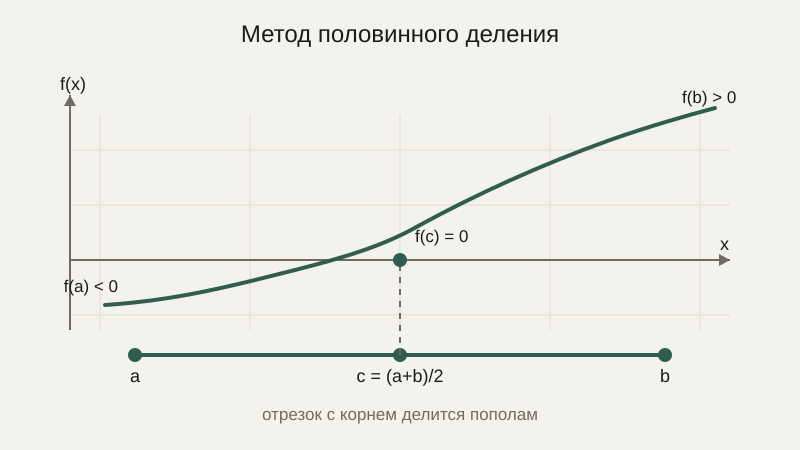
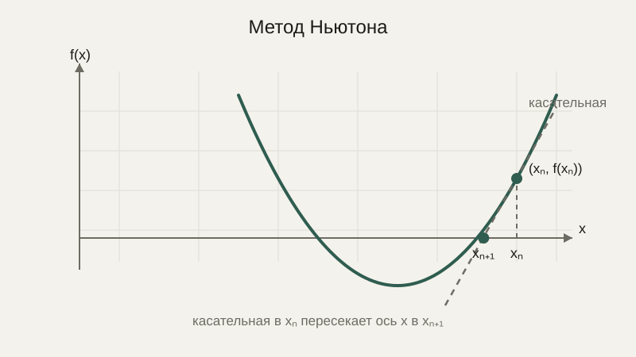

# Численное решение уравнений: бисекция и метод Ньютона

В блоке про алгебру мы решали уравнения точными алгебраическими методами — переносом слагаемых, подстановкой. Но подавляющее большинство уравнений, возникающих в реальных инженерных задачах, не имеют аккуратного алгебраического решения в принципе — например, уравнение $x^5 - x - 1 = 0$ или уравнение, описывающее равновесие сложной механической системы. Для таких случаев существуют методы, которые не находят точный ответ одной формулой, а постепенно, шаг за шагом, приближаются к нему.

## Поиск корня: что мы ищем

**Корень уравнения** $f(x) = 0$ — это значение $x$, при котором функция $f$ обращается в ноль. Любое уравнение $g(x) = h(x)$ можно свести к этому виду, перенеся всё в одну сторону: $f(x) = g(x) - h(x) = 0$. Численные методы ищут не точную формулу для $x$, а приближённое числовое значение, с заданной заранее точностью.

## Метод половинного деления (бисекция)

Самый простой и надёжный из таких методов опирается на интуитивно понятный факт — если непрерывная функция (вспомним понятие непрерывности из блока про предел) в одной точке отрицательна, а в другой положительна, то где-то между ними она обязательно пересекает ноль. Метод половинного деления берёт такой отрезок $[a, b]$, где $f(a)$ и $f(b)$ имеют разные знаки, и делит его пополам: если знак в середине $c = \frac{a+b}{2}$ совпадает со знаком в $a$, значит, корень находится в правой половине $[c, b]$, иначе — в левой $[a, c]$. Повторяя это снова и снова, отрезок, содержащий корень, сужается вдвое на каждом шаге.



```python
def bisection(f, a, b, tolerance=1e-9):
    if f(a) * f(b) > 0:
        raise ValueError("На концах отрезка должны быть разные знаки")
    while (b - a) / 2 > tolerance:
        c = (a + b) / 2
        if f(c) == 0:
            return c
        if f(a) * f(c) < 0:
            b = c
        else:
            a = c
    return (a + b) / 2

f = lambda x: x**2 - 2  # ищем корень, то есть √2
print(bisection(f, 0, 2))  # примерно 1.4142135623
```

Метод надёжен и всегда сходится, если начальное условие (разные знаки на концах) выполнено, но относительно медленный: каждый шаг уменьшает отрезок ровно вдвое — это прямое проявление логарифмической сложности, с которой мы уже встречались в уроке про логарифмы применительно к бинарному поиску в отсортированном списке, здесь работает буквально тот же самый принцип.

## Метод Ньютона

**Метод Ньютона** сходится значительно быстрее, но требует дополнительной информации — производной функции (вот где пригождается блок про анализ). Идея метода: взять текущее приближение $x_n$, провести в этой точке касательную к графику функции (мы уже знаем, что её наклон — это и есть производная) и в качестве следующего приближения $x_{n+1}$ взять точку, где эта касательная пересекает ось $x$:

$$
x_{n+1} = x_n - \frac{f(x_n)}{f'(x_n)}
$$



```python
def newton(f, f_prime, x0, tolerance=1e-9, max_iterations=100):
    x = x0
    for _ in range(max_iterations):
        fx = f(x)
        if abs(fx) < tolerance:
            return x
        x = x - fx / f_prime(x)
    return x

f = lambda x: x**2 - 2
f_prime = lambda x: 2 * x

print(newton(f, f_prime, x0=1.0))  # сходится к √2 значительно быстрее бисекции
```

Метод Ньютона на каждом шаге примерно удваивает число верных знаков — это гораздо быстрее линейного сужения вдвое, как в методе половинного деления. Но у скорости есть цена: метод требует явно вычислимой производной и не гарантированно сходится при неудачном начальном приближении — он может «улететь» в сторону от корня или зациклиться, особенно если производная в какой-то точке траектории оказывается близка к нулю (тогда формула выше делит на почти ноль, а это, как мы помним из первых уроков курса, именно та ситуация, которую нужно всегда проверять заранее).

## Критерий остановки и точность

Оба метода выше никогда не находят корень абсолютно точно (за исключением редких удачных совпадений) — они останавливаются, когда приближение становится «достаточно хорошим» согласно заранее выбранному критерию: либо значение функции в текущей точке становится достаточно близко к нулю, либо отрезок, в котором гарантированно находится корень, становится достаточно узким. Выбор конкретного порога точности — инженерное решение, которое зависит от задачи: для расчёта траектории спутника нужна куда более высокая точность, чем для подбора параметра визуального эффекта в игре.

## Практическое применение

Численный поиск корня используется повсеместно там, где аналитическое решение недоступно или слишком трудоёмко: в расчётах инженерных конструкций, в физических симуляциях, в финансовых моделях (например, поиск процентной ставки, при которой инвестиция окупается ровно к заданному сроку), в калибровке параметров моделей по экспериментальным данным.

## Типичные ошибки

Частая ошибка для метода половинного деления — забыть проверить, что знаки функции на концах начального отрезка действительно разные, что приводит либо к явной ошибке, либо к неверному результату без всякого предупреждения. Вторая, для метода Ньютона — выбрать неудачное начальное приближение, из-за которого метод расходится, вместо того чтобы сходиться к корню. Третья, общая для обоих методов, — установить слишком строгий критерий остановки, игнорирующий то, что числа с плавающей точкой, как мы разобрали в прошлом уроке, сами по себе не бывают бесконечно точными, из-за чего алгоритм никогда не достигает заданного порога и зацикливается — именно поэтому в реальном коде всегда стоит ограничивать максимальное число итераций, как сделано в примере с методом Ньютона выше.

## Что нужно запомнить

Численные методы ищут приближённое, а не точное решение уравнения, когда алгебраическое решение недоступно или неудобно. Метод половинного деления надёжен, но относительно медленный и требует разных знаков функции на концах начального отрезка. Метод Ньютона сходится значительно быстрее, но требует производной и не гарантированно сходится при любом начальном приближении. В обоих случаях нужен явный критерий остановки — заданная точность и ограничение на число шагов.

## Задачи

1. Для функции f(x) = x² - 4 найдите корень методом половинного деления на отрезке [0, 3], сделав вручную 3 шага.
2. Для функции f(x) = x² - 2 примените метод Ньютона с начальным приближением x₀ = 1, сделав 2 шага вручную, и сравните с точным значением √2.
3. Объясните, почему для метода половинного деления обязательно нужно, чтобы на концах отрезка функция имела разные знаки.
4. Приведите пример функции и начального приближения, при котором метод Ньютона может разойтись (не обязательно строго доказывать — обоснуйте идею).
5. Сравните количество шагов, нужных для достижения заданной точности методом половинного деления и методом Ньютона, качественно (какой метод быстрее и почему).
6. Почему в коде численных методов всегда нужно ограничивать максимальное число итераций, даже если есть критерий по точности?

## Где это понадобится дальше

В следующем, завершающем уроке этого блока мы применим ровно ту же логику — постепенное приближение с заданным критерием остановки — не к поиску корня уравнения, а к поиску минимума функции, что приведёт нас прямиком к численной оптимизации и градиентному спуску в его полном, развёрнутом виде.
