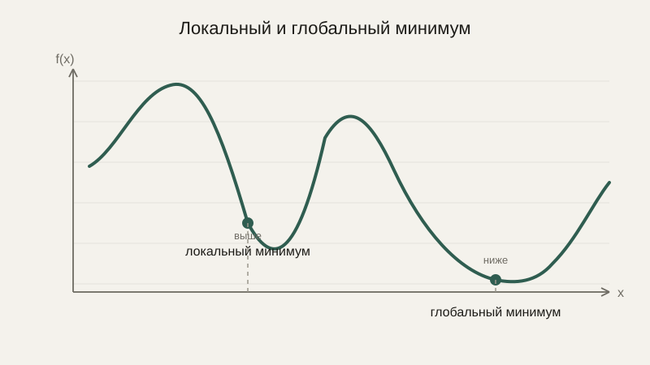
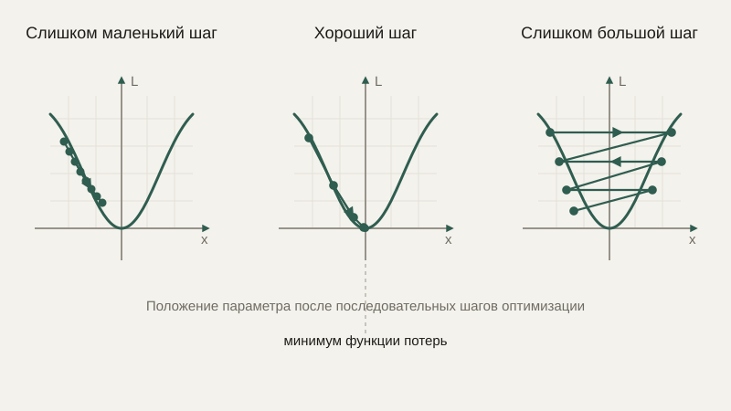

# Численная оптимизация

Мы уже видели градиент как направление наибольшего роста функции и мельком применяли шаг против градиента, чтобы приблизиться к минимуму чаши $f(x,y)=x^2+y^2$. Настало время собрать это в полноценную, самостоятельную тему: как вообще находят минимум сложной функции на практике, когда, в отличие от простой чаши, аккуратной формулы для ответа не существует.

## Функция потерь: во что превращается задача обучения

Практически любая задача «подобрать параметры модели так, чтобы она хорошо соответствовала данным» — от простой линейной регрессии из блока про статистику до сложной нейронной сети — математически сводится к одной и той же формулировке: есть некоторая **функция потерь** (или функция ошибки), которая показывает, насколько плохо модель с текущими параметрами справляется с задачей, и нужно подобрать параметры так, чтобы эта функция была как можно меньше.

Для линейной регрессии функцией потерь была сумма квадратов остатков — мы уже разбирали её в уроке про регрессию. Для задачи классификации изображений функция потерь устроена сложнее, но сама идея остаётся той же: число, которое мы хотим минимизировать, и параметры, которые мы можем менять, чтобы этого добиться.

## Минимум: локальный и глобальный

**Минимум** функции — точка, где значение функции меньше, чем во всех соседних точках (**локальный минимум**), или меньше, чем во всех точках вообще (**глобальный минимум**). Для простой чаши из более ранних уроков эти два понятия совпадают — там только одна впадина. Но реальные функции потерь, особенно в многомерном пространстве параметров нейросети, обычно похожи на холмистый ландшафт с множеством впадин разной глубины:



Алгоритм, который движется «вниз по склону» (как мы делали в уроке про градиент), гарантированно находит **какой-то** минимум, но не обязательно самый глубокий из всех — он может застрять в неглубокой локальной впадине, даже не подозревая, что где-то дальше есть значительно более глубокая.

## Градиентный спуск: практическая реализация

Мы уже видели ключевую формулу шага градиентного спуска в уроке про градиент — повторим её здесь уже в контексте полноценной оптимизации:

$$
\theta_{n+1} = \theta_n - \alpha \nabla f(\theta_n)
$$

где $\theta$ — вектор параметров модели, $\nabla f$ — градиент функции потерь по этим параметрам, а $\alpha$ — **скорость обучения** (learning rate) — число, которое определяет длину каждого шага.

```python
import numpy as np

def f(theta):
    return theta[0]**2 + theta[1]**2

def gradient(theta, h=1e-6):
    grad = np.zeros_like(theta)
    for i in range(len(theta)):
        theta_h = theta.copy()
        theta_h[i] += h
        grad[i] = (f(theta_h) - f(theta)) / h
    return grad

theta = np.array([5.0, 8.0])
learning_rate = 0.1

for step in range(50):
    theta = theta - learning_rate * gradient(theta)

print(theta)  # очень близко к [0, 0] — минимуму функции
```

## Скорость обучения: баланс скорости и устойчивости

Выбор параметра $\alpha$ — скорости обучения — один из самых практически важных нюансов оптимизации, и здесь нет универсально «правильного» значения. Слишком маленький шаг заставляет алгоритм сходиться чрезвычайно медленно, требуя огромного числа итераций, чтобы добраться до минимума. Слишком большой шаг может привести к тому, что алгоритм будет «перепрыгивать» через минимум туда-сюда, никогда толком не сходясь, а в особо неудачных случаях — вообще расходиться, с каждым шагом удаляясь от минимума всё дальше вместо того, чтобы приближаться.



На практике скорость обучения часто не фиксируют раз и навсегда, а постепенно уменьшают по ходу обучения — делая шаги крупнее в начале (когда до минимума ещё далеко и важна скорость) и мельче ближе к концу (когда важна точность и устойчивость).

## Сходимость: когда остановиться

Как и в численном поиске корня из прошлого урока, алгоритм оптимизации нужно останавливать по какому-то явному критерию, а не вести вычисления бесконечно. Типичные критерии: функция потерь перестала заметно уменьшаться от шага к шагу; градиент стал достаточно близок к нулевому вектору (а мы уже знаем из урока про градиент, что это и есть признак критической точки); либо просто достигнуто заранее заданное максимальное число шагов, если первые два условия так и не выполнились.

## Связь с обучением моделей, без ухода в детали нейросетей

Описанный здесь градиентный спуск — это буквально тот же самый алгоритм (с некоторыми практическими усовершенствованиями, которые выходят за рамки этого курса), на котором построено обучение подавляющего большинства современных моделей машинного обучения, включая нейронные сети. Параметры модели играют роль $\theta$, ошибка предсказания на обучающих данных — роль функции потерь $f$, а цепное правило из урока про производную — это именно тот инструмент, которым вычисляется градиент этой функции потерь по каждому из, возможно, миллионов параметров модели одновременно. Мы намеренно не углубляемся в устройство самих нейросетей — это тема отдельного курса, — но весь математический фундамент для его понимания — производная, цепное правило, частные производные, градиент и теперь оптимизация — уже полностью разобран в этом курсе.

## Типичные ошибки

Самая частая практическая ошибка — выбрать скорость обучения «наугад» и не замечать, что функция потерь либо почти не уменьшается (шаг слишком мал), либо скачет хаотично от итерации к итерации, не сходясь (шаг слишком велик) — построение графика значения функции потерь по шагам почти всегда сразу выявляет одну из этих двух проблем. Вторая — принять найденный локальный минимум за глобальный, не предприняв попыток запустить оптимизацию из нескольких разных начальных точек для сравнения результатов. Третья — не предусмотреть ограничение на максимальное число итераций, из-за чего при неудачно подобранных параметрах алгоритм может работать неоправданно долго или вовсе не остановиться.

## Что нужно запомнить

Численная оптимизация ищет параметры, минимизирующие некоторую функцию потерь, с помощью постепенного движения в направлении, противоположном градиенту. Скорость обучения определяет длину каждого шага и требует баланса между скоростью сходимости и устойчивостью алгоритма. Градиентный спуск не гарантирует нахождение глобального минимума, останавливаясь на любом локальном, и именно этот алгоритм, обобщённый и усовершенствованный, лежит в основе обучения практически всех современных моделей машинного обучения.

## Задачи

1. Для f(θ) = θ² сделайте один шаг градиентного спуска из точки θ=10 со скоростью обучения α=0.1.
2. Объясните, что произойдёт с градиентным спуском для f(θ)=θ², если взять α=1.5 (слишком большой шаг), сделав 2 шага вручную из θ=10.
3. Чем отличается локальный минимум от глобального? Приведите пример функции с обоими.
4. Опишите три возможных критерия остановки градиентного спуска.
5. Почему слишком маленькая скорость обучения — это тоже проблема, а не только слишком большая?
6. Предложите простую стратегию выбора скорости обучения, если заранее неизвестно, какое значение подходит.

## Где это понадобится дальше

Блок численных методов и весь базовый математический аппарат курса на этом завершены. В заключительном блоке мы соберём пройденный материал в практические карты — что именно из изученного нужно для алгоритмов, для компьютерного зрения и для машинного обучения — и построим общую математическую карту всего курса.
